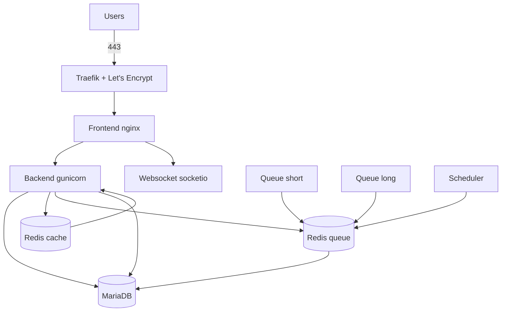

# Solrise ERP

A portable, code-configured Solrise ERP deployment: **CRM**, **Service Desk**,
**HRMS**, approvals, notifications, reporting and administration - built from
`frappe_docker`, run on rootless Podman locally and on any Ubuntu VPS in
production.

Nothing in this repo is tied to a single host, provider or container engine.
One `.env` drives both environments.

---

## Architecture



Locally the `Traefik` hop is replaced by `frontend` publishing port `8080`.

---

## Quick start (local)

```bash
cp .env.example .env         # edit the passwords
chmod +x scripts/*.sh
make image                   # build erpnext + hrms image (first run: ~15 min)
make local-up                # start the stack
make site                    # create the site + install apps
```

Open **http://localhost:8080** and log in as `Administrator` with the
`ADMIN_PASSWORD` from `.env`.

Then apply the programmatic configuration:

```bash
./scripts/run-python.sh scripts/setup_erp.py     # modules, SLA, leave types
./scripts/run-python.sh scripts/roles_rbac.py    # roles + permissions
```

Full walkthrough: [`docs/01-phase1-local-podman.md`](docs/01-phase1-local-podman.md).

---

## Quick start (production VPS)

```bash
# On the VPS, as root, from a clone of this repo:
sudo SWAP_SIZE=4G ./scripts/bootstrap-vps.sh

# As the deploy user:
cp .env.example .env         # set DOMAIN, SITE_NAME, ports 80/443, DOCKER_SOCK
make image
SITE_ENV=prod make prod-up
SITE_ENV=prod make site
```

Full walkthrough: [`docs/03-phase3-production-vps.md`](docs/03-phase3-production-vps.md).

---

## Documentation

| Doc | Contents |
|-----|----------|
| [`docs/PLAN.md`](docs/PLAN.md) | **Phase-wise master plan, milestones, status** |
| [`docs/01-phase1-local-podman.md`](docs/01-phase1-local-podman.md) | Rootless Podman, subuid/subgid, compose, site init |
| [`docs/02-phase2-module-config.md`](docs/02-phase2-module-config.md) | `setup_erp.py`, RBAC, workflows, fixtures |
| [`docs/03-phase3-production-vps.md`](docs/03-phase3-production-vps.md) | VPS prep, Traefik, TLS, volumes, migration |
| [`docs/04-operations-runbook.md`](docs/04-operations-runbook.md) | Backups, restore, upgrades, scaling, logs |
| [`docs/05-troubleshooting.md`](docs/05-troubleshooting.md) | Symptom -> cause -> fix |
| [`docs/06-phase4-assistant.md`](docs/06-phase4-assistant.md) | AI assistant: guardrails, tools, audit, test plan |
| [`docs/07-phase4-notifications-reporting.md`](docs/07-phase4-notifications-reporting.md) | SMS/WhatsApp channels, reports, dashboards, log retention |
| [`docs/08-execution-checklist.md`](docs/08-execution-checklist.md) | **Run order for going live, with pass/fail checks** |
| [`docs/09-execution-log.md`](docs/09-execution-log.md) | **What actually happened when it was run: evidence + every bug fixed** |
| [`docs/10-branding.md`](docs/10-branding.md) | **White-label branding (Solrise) and US/USD locale defaults** |
| [`docs/14-vps-to-aws-migration.md`](docs/14-vps-to-aws-migration.md) | **VPS → AWS cutover: go live on VPS now, build AWS in parallel, flip DNS to Route 53** |
| [`docs/15-s3-media-storage.md`](docs/15-s3-media-storage.md) | **Uploaded files on S3 (media off the EC2 volume): bucket, credentials, migration, caveats** |
| [`infra/README.md`](infra/README.md) | **AWS deployment: Terraform (EC2 + RDS MariaDB) + Ansible configure/deploy, image built in CI** |
| [`infra/PREREQUISITES.md`](infra/PREREQUISITES.md) | **Accounts, keys and credentials required before `terraform init` / Ansible** |

---

## Common commands

```bash
make help          # list every target
make image         # build the custom image
make local-up      # start local stack
make site          # create site + install apps (idempotent)
make logs          # tail logs
make shell         # bash inside the backend container
make backup        # dump DB + files to ./backups
make fixtures      # export fixtures

SITE_ENV=prod make prod-up   # production stack
SITE_ENV=prod make prod-logs
SITE_ENV=prod make backup
```

---

## Configuration model

1. **Image** - `apps.json` + `APPS_JSON` bake `erpnext` and `hrms` into
   `solrise/erpnext:<tag>`. Apps are never `get-app`'d inside a running
   container, because that is lost on recreate.
2. **Runtime** - `compose/compose.local.yaml` (no TLS) and
   `compose/compose.prod.yaml` (Traefik + Let's Encrypt) share the same service
   topology; only exposure and developer-mode differ.
3. **Data** - everything that must survive lives in a named volume declared in
   `.env`: `solrise_sites`, `solrise_db_data`, `solrise_redis_queue`,
   `solrise_letsencrypt`.
4. **Application config** - `scripts/setup_erp.py` and `scripts/roles_rbac.py`
   are idempotent and version-safe. The custom app applies workflows,
   notifications, reports and dashboards itself on every `bench migrate`
   (`solrise_erp.install.apply_all`). Everything is exported as fixtures under
   `fixtures/` so a fresh deployment reproduces itself.

---

## Portability guarantees

- Same `.env` keys on every host; only values change.
- Same service names and image across Podman and Docker.
- `CONTAINER_ENGINE` / `COMPOSE_CMD` switch the tooling without editing YAML.
- Backup and restore work across site names and across engines
  (`bench backup --with-files` -> `bench restore`).
- No host paths are hard-coded outside bind mounts that are opt-in.
