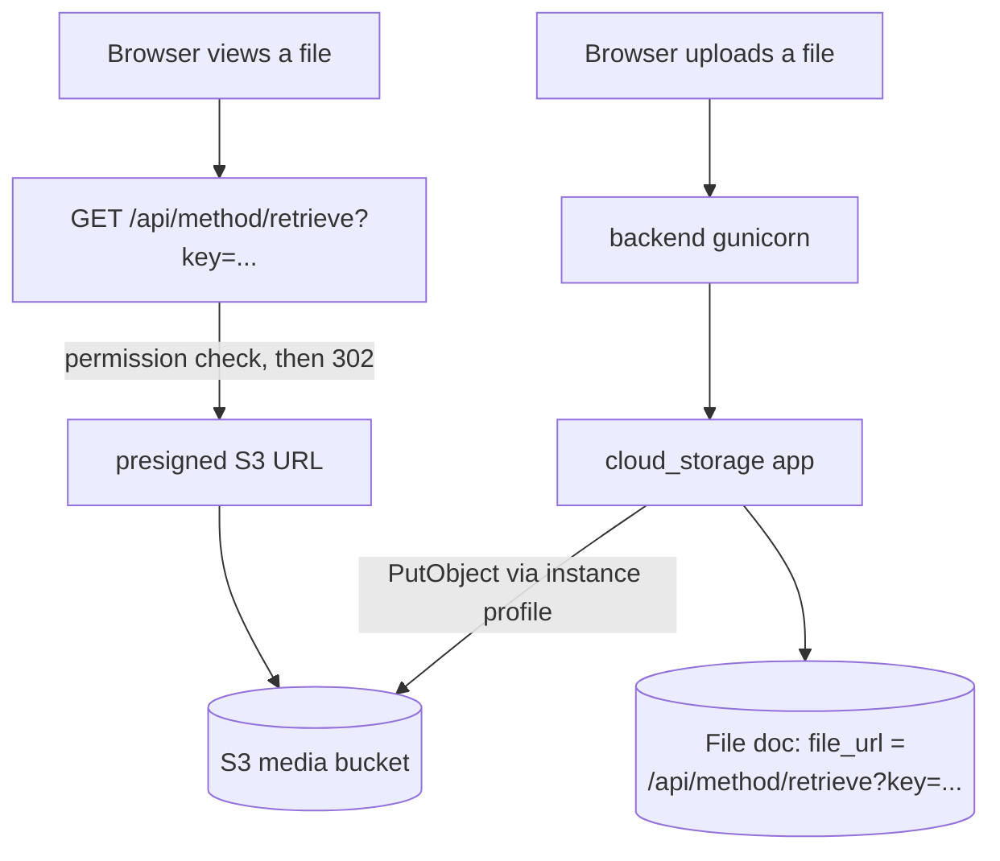

# 15 - Uploaded files on S3 (media off the EC2 volume)

Every file ERPNext stores - attachments, item images, employee documents,
private uploads - can live in an S3 bucket instead of the EC2 volume. This doc
explains what the repo does, what it deliberately does *not* do, and how to run
it.

> **Status.** Running in production: uploads (public and private) land in the
> bucket, `File.file_url` is `/api/method/retrieve?key=...`, the volume's
> `public/files` and `private/files` stay empty, deletes remove the S3 object, and
> an anonymous request for a private file gets `403`. The deploy still round-trips
> an object through the bucket and fails loudly if it cannot. Read
> [Verifying](#verifying) and [Caveats](#caveats) before changing the setup.

---

## What changes



The EC2 volume keeps the database connection, the site config and the code; file
bytes go to the bucket, and the bucket is private - nothing is served directly
from it.

| Concern | Where it lives in this repo |
|---|---|
| Bucket, encryption, versioning, lifecycle, TLS-only policy | `infra/terraform/storage.tf` (`aws_s3_bucket.media`) |
| Instance-role permissions (`Put/Get/Delete/ListBucket`) | `infra/terraform/iam.tf` (`aws_iam_role_policy.media`) |
| Bucket name handed to Ansible | `infra/terraform/outputs.tf` -> `group_vars/all/terraform.yml` |
| The app itself, baked into the image | `apps.json` (`agritheory/cloud_storage`, pinned) |
| Installed on the site | Ansible appends `cloud_storage` to `INSTALL_APPS` (`templates/env.j2`) |
| Site config, credentials check, migration | `scripts/setup-media.sh` -> `scripts/configure_s3_media.py` |
| Patch that makes the pinned app fit this stack | `infra/image/patch-cloud-storage.py` |
| Runs during the deploy | `infra/ansible/roles/solrise/tasks/main.yml` |

### What deliberately still lives on the EC2 volume

Media is off the volume, but these are not media and stay where they are:

| Still on the volume | Why |
|---|---|
| `sites/<site>/private/backups/*.sql.gz` | Database dumps from `bench backup` |
| `sites/<site>/logs/`, `locks/`, `task-logs/` | Frappe's own runtime state |
| `sites/<site>/site_config.json`, `common_site_config.json` | Configuration, including the bucket settings |
| `sites/assets/`, the bench `apps/` tree | Code and built assets |
| `sites/<site>/public/files/website_theme/*.css` | Theme CSS written by `website_theme` setup, not an upload |

So "empty volume" means an empty `public/files` and `private/files`. The backup
directory is expected to grow, and is what `scripts/backup.sh` syncs (see
[Backups](#backups-after-the-switch)).

## Why an app is needed

Frappe v15 has no S3 support in core. Its `File` doctype delegates the actual
write, read-url and delete to hooks (`write_file`, `delete_file_data_content` in
`frappe/core/doctype/file/file.py`), and storage backends are implemented by
installed apps. This repo uses [`agritheory/cloud_storage`][cs] (MIT, v15 branch,
`override_doctype_class` on `File`) and pins it to a tag in `apps.json` so the
image is reproducible.

[cs]: https://github.com/agritheory/cloud_storage

### The one patched file

`infra/image/patch-cloud-storage.py` applies four edits to that pinned release at
**image build time** (`infra/image/Containerfile`, built as a second stage by
`scripts/build-image.sh`):

1. **Credentials from the instance profile.** Upstream requires an access key and
   secret in the site config and refuses to run without them. With the check
   removed, `boto3.Session(None, None, region)` resolves the default credential
   chain - the EC2 instance profile - including automatic refresh for long-lived
   gunicorn and RQ processes. That is the same "no static AWS credentials on the
   host" rule the rest of `infra/terraform/iam.tf` follows.
2. **No `Data Import` bypass.** Upstream writes attachments for that doctype to
   the local filesystem. Nothing needs that: the importer reads the attachment
   through `File.get_content()` (`frappe/core/doctype/data_import/importer.py`),
   which this app already serves from S3. With the special case removed, import
   spreadsheets are the last upload path that used to leave a copy on the volume.
3. **No local thumbnails.** Core's `File.make_thumbnail()` resizes the image and
   saves it as `public/<name>_small.<ext>` with a plain `open()`/`write()`, which
   bypasses the storage hook and would put bytes on the EC2 disk. The override
   never writes a derived object: it points `thumbnail_url` at `file_url` (the
   cloud URL) and returns it. The only production caller is HRMS Daily Work
   Summary emails; cloud files are served at full size through
   `/api/method/retrieve`, which needs no derived object.
4. **No LibreOffice.** Upstream's install hook demands `libmagic1` *and*
   `libreoffice` (only used for PPT/ODP previews) and apt-gets them via sudo. In a
   container there is no sudo, and anything apt installs is discarded when the
   container is replaced - so the install would fail. `libmagic1` alone is kept,
   and the stock Frappe base image already ships it.

Every edit is exact-match and asserted: if the pinned tag stops looking the way
the patch expects, **the image build fails** instead of shipping a broken app. The
script is idempotent (added lines carry a `Solrise:` marker), and `sanity_check()`
also parses the patched file to confirm `make_thumbnail` really is a method of
`CloudStorageFile` - inserting it at the wrong offset used to produce a nested
function that compiled but was never called. If you bump the tag in `apps.json`,
re-check `infra/image/patch-cloud-storage.py`.

## Configuration it writes

`scripts/configure_s3_media.py` writes one dict into
`sites/<site>/site_config.json` (idempotently - only when it changed):

```json
"cloud_storage_settings": {
  "region": "us-east-1",
  "endpoint_url": "https://s3.us-east-1.amazonaws.com",
  "bucket": "solrise-media-123456789012",
  "folder": "solrise",
  "expiration": 300
}
```

* `folder` is the key prefix inside the bucket
  (`solrise/<DocType>/<document>/<file>`) - one bucket can host several sites.
* `expiration` is the lifetime of the presigned URL the browser is redirected to
  for a **private** file.
* `access_key` / `secret` are written **only** if `s3_media_access_key` and
  `s3_media_secret_key` are set in `group_vars` (non-AWS providers that have no
  instance profile). On AWS they stay empty.

## Running it

Prerequisites: the app is in the image, so **rebuild and push the image first**,
then deploy.

```bash
# 1. Provision the bucket + IAM (idempotent; safe on an existing stack)
cd infra/terraform && terraform apply
terraform output media_bucket

# 2. Rebuild the image so cloud_storage is baked in (CI)
gh workflow run build-image.yml -f tag=version-15

# 3. Deploy: pulls the image, installs the app on the site, writes the config
cd infra/ansible && ansible-playbook site.yml --ask-vault-pass
```

The deploy ends with a bucket round trip. If you only want to re-apply the
storage settings on the host (`SITE_ENV=aws` picks the AWS stack):

```bash
SITE_ENV=aws make media
```

Keep in mind that Ansible owns `.env` - it is re-rendered on every deploy, so
hand-edits there are undone by the next `ansible-playbook` run. Change the
`group_vars` instead.

Expected output:

```
[solrise] media bucket: s3://solrise-media-123456789012 (us-east-1), folder=solrise
  bucket=solrise-media-123456789012 region=us-east-1 endpoint_url=https://s3.us-east-1.amazonaws.com folder=solrise
  credentials=instance profile (boto3 default chain)
bucket round trip: OK (s3://solrise-media-123456789012/solrise/_solrise-media-probe.txt, deleted)
site config: updated
media storage configured on erp.example.com: s3://solrise-media-123456789012/solrise
```

## Verifying

In the ERP: attach a file to any document, then check that the `File` doc's URL is
`/api/method/retrieve?key=solrise/...`, that the object exists in the bucket, and
that the file is **not** on the volume:

```bash
podman exec -it solrise-backend bash -lc \
  'ls sites/erp.example.com/public/files sites/erp.example.com/private/files | tail'
aws s3 ls --recursive s3://solrise-media-123456789012/solrise/ | tail
```

(`solrise-backend` is the friendly name used throughout these docs; list the real
ones with `podman ps --format '{{.Names}}'`. `podman-compose` names it
`solrise_backend_1`, Docker Compose `solrise-backend-1`.)

Then confirm the browser can open it, and that a private file is unreachable
without a session (the URL redirects only after Frappe's File permission check).

## Migrating the files that are already on the volume

Off by default - new uploads are offloaded either way. Ansible renders those
switches into `.env` and re-renders it on every deploy, so drive the migration
from Ansible rather than editing `.env` on the host:

```yaml
# infra/ansible/group_vars/all/main.yml
s3_media_migrate_existing: true
s3_media_migrate_dry_run: true     # report only, upload nothing
s3_media_migrate_remove_local: false
```

```bash
cd infra/ansible && ansible-playbook site.yml --tags deploy --ask-vault-pass
```

Read the report, then set `s3_media_migrate_dry_run: false` and run the deploy
again (add `s3_media_migrate_remove_local: true` to delete the local copies and
reclaim the volume space - they are kept otherwise). Finally set
`s3_media_migrate_existing` back to `false`: the deploy reports
`site config: unchanged` from then on.

To migrate by hand instead, use the app's own bench command on the host - it
takes the same switches and prints the same report:

```bash
podman exec -it solrise-backend bench --site erp.example.com \
  migrate-files-to-cloud-storage --dry-run
podman exec -it solrise-backend bench --site erp.example.com \
  migrate-files-to-cloud-storage --limit 100 --remove-local
```

**Before any migration: take a backup, and keep it.** `make backup` on the
current (volume-based) deployment gives you the pre-switch state, and restoring
it is the supported rollback - see below.

## Backups, after the switch

`bench backup --with-files` tars the site's `public/files` and `private/files`
directories. Once files live in S3 those directories are empty, so:

* media protection becomes **S3 object versioning** (enabled by Terraform);
  superseded versions are kept for `media_noncurrent_version_retention_days`
  (90) and then expired;
* the nightly `BACKUP_DIR` + optional `s3://<backup bucket>/files/` sync now only
  covers the database and any files still on the volume - `scripts/backup.sh`
  says so in its log;
* for real disaster recovery, add cross-region replication to the media bucket or
  a periodic `aws s3 sync s3://<media> s3://<backup>`; neither is wired up here.

## Caveats

* **Deleting files is a versioned delete.** With versioning on, deleting a `File`
  in the UI adds a delete marker; the bytes remain until the lifecycle rule
  expires them. Storage grows accordingly.
* **Private files stream through Frappe.** The app redirects to a presigned URL,
  so downloads still hit gunicorn (and `CLIENT_MAX_BODY_SIZE`/`PROXY_READ_TIMEOUT`
  in `.env` still apply to uploads).
* **`Data Import` attachments now go to the bucket too.** The patch removes the
  app's special case for that DocType, so import spreadsheets are no longer copied
  to the volume. Any that were uploaded before the patch stay on the volume (and
  keep working) until you re-upload or migrate them.
* **File-list visibility changes.** The app replaces Frappe's
  `get_permission_query_conditions` for `File` with its own (docshare-aware)
  implementation, so long File lists can be filtered differently for System Users.
* **Zip "unzip" and the PPT/ODP preview button do not work** for offloaded files
  (Frappe's `File.unzip` wants a local path, and the patch removed LibreOffice).
  Image *optimization* does work.
* **Do not upgrade the pinned app tag casually** - re-verify the patch first.

### Known limitations

These are inherited from the upstream app (or from Frappe v15's assumption that a
`File` always has a local path). They are recorded so nobody has to rediscover
them; neither is used by this deployment today.

* **Modules that ask for a local path fail on cloud files.**
  `File.get_full_path()` returns `self.file_url` for a cloud file, i.e. an URL
  rather than a filename, so `open()` raises `FileNotFoundError`. This affects
  Bank Statement Import and stock reposting. The same is true of
  `frappe.utils.file_manager.save_file()`: the app's `write_file` hook signature
  does not match what frappe 15.121.x passes it, so that helper breaks - only two
  niche ERPNext modules call it.
* **Thumbnails are not generated.** `make_thumbnail` returns the original cloud
  URL (patch 3), so lists show the full-size image scaled by CSS instead of a
  300x300 derivative. Correct, just heavier.

## Turning it off

`enable_media_bucket = false` (Terraform) and/or `s3_media_enabled: false`
(Ansible) stops the *provisioning*; what actually happens to files is decided by
the site config, so know the difference:

* **Stop sending new uploads to S3** - set `s3_media_write_local: true` and run
  the deploy (or add `"use_local": 1` to `cloud_storage_settings` by hand). New
  files are written to the volume again, and files already in the bucket stay
  readable, because their `file_url` still points at
  `/api/method/retrieve?key=...`.
* **Do not remove `cloud_storage_settings`** while any `File` row references that
  URL: `retrieve` needs the bucket config to sign a URL, so those files would
  stop opening.
* **Keep the bucket** for as long as such rows exist. `terraform destroy`
  refuses to delete a bucket that still holds objects (`force_destroy = false`).
* **There is no reverse migration.** The supported rollback to a fully
  volume-based site is restoring the database *and* files from the pre-switch
  backup (`scripts/restore.sh`).
