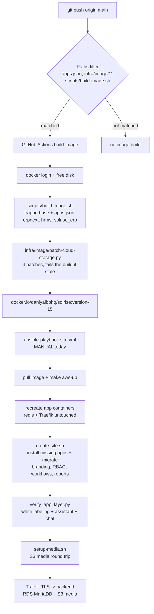
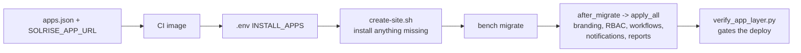

# 16 - Deployment pipeline status

What is automated, what is verified working, and what is still open. This is the
context document: read it first before touching the AWS stack, and update it
whenever a pipeline stage changes state.

Last updated: 2026-09-17 (live-host checks; section 5.1 is an acceptance list and
section 5.4 records the interim deployment that needs no app).

---

## 1. The pipeline



Two stages are automated, one is not:

| Stage | Status | Trigger |
|---|---|---|
| Terraform provisioning (EC2, RDS, S3, IAM) | Working, manual | `cd infra/terraform && terraform apply` |
| Image build + push to Docker Hub | **Automated** | push to `main` touching `apps.json`, `apps.example.json`, `infra/image/**`, `scripts/build-image.sh`, `scripts/push-image.sh`, `scripts/apps-fingerprint.py`, or the workflow; or `gh workflow run build-image.yml` |
| Deploy on the host (pull, rollout, site + apps + branding, media, verification) | Manual | `cd infra/ansible && ansible-playbook site.yml --ask-vault-pass` |

There is deliberately no CD workflow yet (see [Open items](#6-open-items)).

## 2. The live stack

| Fact | Value |
|---|---|
| AWS account / region | `358254890883` / `us-east-1` |
| EC2 host | `54.80.60.124` (tagged `Role=solrise-app`), Ubuntu 24.04, rootless Podman 4.9.3 + podman-compose 1.5.0 |
| Site / domain | `erp.solrise.online` (Traefik v3.7, Let's Encrypt `daniyalbphq@gmail.com`) |
| Database | RDS MariaDB `solrise-db.cyj2g0qsc566.us-east-1.rds.amazonaws.com:3306`, master `solrise_admin`, password only in Secrets Manager |
| Media | `s3://solrise-media-358254890883/solrise/` (private, versioned, AES256, TLS-only) |
| Backups | `s3://solrise-backups-358254890883` exists, but the S3 sync is **off** (`backup_s3_enabled: false`) |
| Image source | Docker Hub `docker.io/daniyalbphq/solrise:version-15` (**private repo**); ECR is unused (`ecr_repository_url` is empty) |
| Apps in the image | `erpnext`, `hrms`, `solrise_erp` (from `${SOLRISE_APP_URL}`), `cloud_storage` - baked by CI from `apps.json`. Until 2026-09-16 the Solrise app was missing here, so the image carried no branding and no chat |
| Apps on the site | `INSTALL_APPS` from the rendered `.env` (`install_apps` + `solrise_erp` + `cloud_storage` when those features are on); `scripts/create-site.sh` installs any that the site is missing |
| Application layer today | `solrise_app_enabled: false` (the app has no repository to build from) - so the site carries the repository + fixture half of it instead: branding, RBAC, module settings, SLA, workflows, notifications, reports, dashboards. See [§5.4](#54-interim-what-is-deployed-without-the-app-2026-09-17) |
| Repo / remote | `git@github.com:daniyalbphq-commits/solrise-erp.git` (remote `origin`). `core.sshCommand` pins `~/.ssh/id_ed25519_bphq`, which authenticates as `daniyalbphq-commits`; the default key authenticates as `DaniyalM`, who can read the (public) repo but is refused write: `Permission ... denied to DaniyalM` |
| Repo on the host | `/opt/solrise-erp` (cloned by the Ansible role, so it carries the dirty file modes the role's chmod task causes) |

Credentials, and where each one lives - no secrets in the repo:

| Secret | Lives in | Used by |
|---|---|---|
| RDS master password | Secrets Manager (`db_secret_arn`) | read on the host by the `solrise` role (instance role), then passed to `create-site` |
| Frappe admin password, Docker Hub username + token | Ansible Vault, `infra/ansible/group_vars/all/vault.yml` | deploy role (`.env` render, `podman login`) |
| S3 access | EC2 instance profile (`iam.tf`), no static keys | `cloud_storage` inside the container |
| `DOCKERHUB_USERNAME` / `DOCKERHUB_TOKEN` | GitHub repository **variables** today (workflow accepts `secrets.X || vars.X`) | `build-image` workflow |
| `SOLRISE_APP_URL` (app remote, and the token for it when private) | GitHub repository **secrets** | `build-image` workflow - `apps.json` bakes the app in from it |
| Assistant provider API key | **Solrise Settings** on the site (`api_key`, encrypted), entered by an operator | the LLM assistant and the chat's optional LLM slot-filler |
| SMS / WhatsApp provider credentials | **Solrise Notification Channel** on the site | `channels.dispatcher` (`docs/07`) |

> Move `DOCKERHUB_TOKEN` to repository *secrets*: variables are stored in plaintext
> and are not masked in the run logs. The workflow warns about this on every run.

## 3. Verified working

Evidence from the live stack on 2026-09-16. Re-run the checks in
[section 4](#4-how-to-verify) rather than trusting this list blindly. (The
2026-09-17 interim application layer has its own evidence table in §5.4.)

| Capability | Verified how |
|---|---|
| CI build + push | `build-image` runs green for `8416d71`; image `docker.io/daniyalbphq/solrise:version-15` |
| Image contents | all four `cloud_storage` patches present, `make_thumbnail` a real `CloudStorageFile` method, files compile |
| Rollout | all six app containers recreated on the new image ID; `redis`/`proxy` untouched; site returns `200` |
| Media → S3 (uploads) | public and private uploads land in the bucket; `File.file_url` is `/api/method/retrieve?key=...`; `public/files` + `private/files` stay empty |
| Media → S3 (delete) | deleting a `File` removes the S3 object; an anonymous request for a private file gets `403` |
| Media → S3 (Data Import) | probe attachment on `Data Import` was served from the bucket (object present, 16 bytes) with nothing written to the volume |
| Media → S3 (thumbnails) | `make_thumbnail` resolves to `CloudStorageFile.make_thumbnail`, returns the cloud URL, creates no `<name>_small.<ext>` on disk |
| RDS wiring | site boots against RDS with the instance role reading the master secret on the host |
| Traefik TLS | `https://erp.solrise.online` serves `200` |

## 4. How to verify

Deploy, then check the five things that actually matter:

```bash
# on the workstation
cd infra/ansible && ansible-playbook site.yml --ask-vault-pass

# on the host (ssh -i ~/.ssh/solrise_ed25519 ubuntu@54.80.60.124)
export XDG_RUNTIME_DIR=/run/user/1000

# 1. which image is really running (must match the tag Docker Hub serves)
podman inspect --format '{{.Name}} {{.Image}}' solrise_backend_1

# 2. the patched app is in the running container
podman exec solrise_backend_1 grep -c 'Solrise:' \
  /home/frappe/frappe-bench/apps/cloud_storage/cloud_storage/cloud_storage/overrides/file.py

# 3. nothing is accumulating on the volume
podman exec solrise_backend_1 ls /home/frappe/frappe-bench/sites/erp.solrise.online/private/files \
                                       /home/frappe/frappe-bench/sites/erp.solrise.online/public/files

# 4. the site answers
curl -s -o /dev/null -w '%{http_code}\n' https://erp.solrise.online

# 5. the Solrise application layer is really installed: white labeling, the
#    assistant, the universal chat, the RBAC artifacts
cd /opt/solrise-erp && SITE_ENV=aws make verify
```

Then upload a file in the UI and confirm the `File` row's `file_url` is
`/api/method/retrieve?key=solrise/...`. Full detail in
[`docs/15-s3-media-storage.md`](15-s3-media-storage.md).

### Running a Frappe script in the container

The container has no site context, so a script must `chdir` before importing
`frappe` (otherwise it looks for `/home/frappe/logs/database.log`):

```bash
podman exec -i solrise_backend_1 /home/frappe/frappe-bench/env/bin/python - <<'PY'
import os
os.chdir("/home/frappe/frappe-bench/sites")
import frappe
frappe.init(site="erp.solrise.online", sites_path="/home/frappe/frappe-bench/sites")
frappe.connect()
# ...
frappe.destroy()
PY
```

## 5. The application layer: white labeling, chat and the rest of the product

**Status: acceptance list, not evidence.** Until 2026-09-16 the AWS deployment
shipped **without the Solrise application layer**: `apps.json` had lost its
`${SOLRISE_APP_URL}` entry (commit `d969821`, "Prod build working") when the first
AWS build had to pass, so the image was plain platform + HRMS and the site had no
Solrise branding, no assistant, no universal chat, no RBAC fixtures, no reports
and no dashboards. The configuration is fixed - the app is in `apps.json`, in
`INSTALL_APPS`, installed on sites that already exist, and checked by the deploy -
but the app itself has **no repository to build from**, so nothing can be built
into an image yet (§6 item 8). **Section 5.4 records what was deployed instead.**
Treat the table as the requirement, section 3 as the evidence, and move each row
up to section 3 once you have run its check.

### 5.1 What the deploy must deliver

| # | Requirement | Applied by | How to check |
|---|---|---|---|
| 1 | **White labeling**: `Solrise` everywhere a user looks - Desk/tab title, login page and footer, website chrome, app switcher, sidebar workspaces, navbar logo, plus the **US/USD** locale defaults | `solrise_erp.branding.ensure_branding()` (from `after_migrate` -> `apply_all()`), with `boot.py`, `public/js/solrise_erp.js` and the footer template override for the payload the upstream app patches later | `make verify` (`System Settings.app_name`, `Website Settings.app_name`); then open the login page - it must read **Solrise**. Detail: `docs/10-branding.md` |
| 2 | **Modules and programmatic configuration** - HR/HRMS, Selling, Buying, CRM and Support settings, genders, leave types, SLA, assignment rule | `scripts/setup_erp.py`, run by `scripts/create-site.sh` on every deploy | re-run `./scripts/run-python.sh scripts/setup_erp.py`; every line is `= exists`, `= updated` or an explicit `skip`, never a duplicate |
| 3 | **RBAC**: the role catalogue, the DocPerm matrix, row-level rules and User Permission scoping | `scripts/roles_rbac.py` + `solrise_erp/permissions.py` hooks + `fixtures/solrise_erp/custom_docperm.json` | `make verify` (role checks); `docs/11-rbac.md` section 10 for the matrix |
| 4 | **Approval workflows** (leave, expense, quotation, purchase) with states and actions | app `apply_all()` on every `migrate` (+ `fixtures/.../workflow.json`) | `make verify` (workflow count); a new Leave Application shows the workflow action buttons |
| 5 | **Notifications**: in-app + email notifications, the daily digest and the SLA/stale scans; **SMS/WhatsApp** through a channel document | app `notifications.py` / `tasks.py`, run by the `scheduler` container | `make verify` (notification count, message log); configure a channel then `solrise_erp.api.v1.send_test_message`. Detail: `docs/07-phase4-notifications-reporting.md` |
| 6 | **Reporting**: nine `Solrise *` query reports and the **Solrise Operations** dashboard with five charts | app `reports.py` / `dashboards.py` on every `migrate` (+ fixtures) | `make verify` (report + dashboard checks); Desk -> Reports / Dashboard |
| 7 | **LLM assistant ("Ask Solrise")**: provider-agnostic chat over the user's own permissions, tool allowlist, rate limit, `Solrise Chat Log`, SLA/escalation/digest jobs | app `assistant/`, driven by **Solrise Settings**; needs an operator-supplied provider key | `make verify` (health + `api.chat`), then `engine.ask("How do I reset my password?")` in a bench console; detail: `docs/06-phase4-assistant.md` |
| 8 | **Universal chat entry flow**: one surface in Desk **and** Portal that resolves a request to a DocType operation, gates it on permissions, fills missing fields and audits every decision | app `chat/`, `api.chat.turn`, `Solrise AI Audit Log`, `public/js/solrise_chat.js` (`app_include_js` + `web_include_js`) | `make verify` (both endpoints exposed), then the manual walkthrough in `docs/12-phase5-universal-chat-entry-flow.md` section 8.2 |
| 9 | **Media on S3** | `cloud_storage` + `scripts/setup-media.sh` | section 3 of this document / `docs/15-s3-media-storage.md` |
| 10 | **Reproducibility**: all of the above is re-declared from code on every `bench migrate` and exported under `fixtures/` | `solrise_erp.install.apply_all()` + `make fixtures` | `make fixtures && git diff --exit-code fixtures` after a migrate |

> Rows 1-8 are the product. Without the app in the image they are simply absent -
> not broken, absent - which is why `apps.json` and `INSTALL_APPS` are part of the
> deployment contract and not build detail.

### 5.2 The chain that now enforces it



* **`apps.json`** (repo root) is the app list, and `${SOLRISE_APP_URL}` /
  `${SOLRISE_APP_BRANCH}` are expanded from the environment, so one file works on
  any host. CI needs the `SOLRISE_APP_URL` secret and fails with an actionable
  error when it is empty; the build-on-the-host fallback reads `solrise_app_url`
  from `group_vars/all/main.yml`. The URL is mounted as a BuildKit **secret**, so
  a token in it never reaches an image layer.
* **`effective_install_apps`** (role fact) appends `solrise_erp` when
  `solrise_app_enabled` is true (default) and `cloud_storage` when
  `s3_media_enabled` has a bucket to talk to.
* **`scripts/create-site.sh` installs anything missing** before it migrates. The
  `create-site` service only installs `INSTALL_APPS` when it *creates* the site,
  so without this step a newly added app would be in the image and never on the
  site - which is exactly how the live site would have stayed unbranded.
* **`bench migrate`** runs `after_migrate` -> `solrise_erp.install.apply_all()`:
  branding, workspaces, roles/permissions, workflows, notifications, reports,
  dashboards and the app's DocTypes.
* **`scripts/verify_app_layer.py`** (`SITE_ENV=aws make verify`) fails the deploy
  when the app, the branding, the assistant/chat entry points or the
  configuration artifacts are missing. Anything only a human can decide is
  reported as a `warn`, not a failure.

### 5.3 What no deploy can do for you

These are the operator's, and they are the difference between "installed" and
"usable" - all of them live in site configuration, none in git:

* **The assistant's provider and key** - `Solrise Settings` (`enabled`, `provider`,
  `api_base_url`, `api_key`, `model`, `rate_limit_per_hour`). Until that is set,
  "Ask Solrise" and the chat's optional LLM slot-filler answer nothing.
  Programmatic form: `docs/06-phase4-assistant.md` section 4.2.
* **A messaging channel** for SMS/WhatsApp - `Solrise Notification Channel`
  (`docs/07-phase4-notifications-reporting.md` section 7.2).
* **The guardrail switches** - `allow_record_lookup` / `allow_ticket_creation` /
  `allow_status_update` on the assistant, `chat_allow_delete` /
  `chat_allow_approve` / `chat_enforce_permlevel` / `chat_allowed_doctypes` /
  `chat_allowed_workflows` on the chat, and the retention windows
  (`chat_log_retention_days`, `audit_log_retention_days`). Defaults are the safe
  ones; change them deliberately.
* **The `Company` record** - `bench new-site` does not run the setup wizard, so a
  fresh site has no company and HR/payroll/accounting refuse to work until you
  run it (`docs/08-execution-checklist.md` section 2.5).
* **Real users** - named accounts with the Stage 2 roles, 2FA on `Administrator`.

### 5.4 Interim: what is deployed **without** the app (2026-09-17)

The app has no repository to build from (§6 item 8), so it cannot be in the
image. Everything in §5.1 that lives in *this* repository, or in the app's
exported fixtures, was deployed directly to `erp.solrise.online` instead - after a
backup (`/opt/solrise-erp/backups/20260916-174016/`) and with `bench migrate` left
to the next deploy:

| Requirement | Delivered by | Evidence on the live site |
|---|---|---|
| **White labeling** (the DocType half of `docs/10`) + US/USD locale | `scripts/branding_only.py` (new) | `System Settings.app_name` `ERPNext` -> `Solrise`, `language` `en`, `time_zone` `America/New_York`; `Website Settings.app_name` `Frappe` -> `Solrise`, `brand_html` lockup, `copyright` `Solrise`; login page renders **Login to Solrise**, **Create a Solrise Account**, **© Solrise**; `Company` `@solrise` -> `Solrise` (abbr stays `@solrise`) |
| **Modules and settings**, Issue SLA, routing rule | `scripts/setup_erp.py` (its first successful run here) | HR/Selling/Buying/CRM/Support settings set; `Earned Leave` + `Casual`/`Sick` leave types; Issue Priorities; `Solrise Default Holidays`; `SLA-Issue-Standard` (4 priorities, enabled, default); `Solrise Support Routing` (Round Robin, `status == 'Open'`) |
| **RBAC** | `scripts/roles_rbac.py` | 8 roles created; Custom DocPerm matrix written on 13 DocTypes, each after copying the DocType's shipped rules - `System Manager` keeps read/write/create/delete/submit on `Issue`, `Support Team` keeps its rows (no lockout) |
| **Approvals** | `scripts/import_app_fixtures.sh` (new) over `fixtures/.../workflow*.json` | 4 workflows: `Solrise Leave Approval`, `Solrise Expense Approval`, `Solrise Purchase Order Approval`, `Solrise Payment Approval` (Pending Approval -> Approved / Rejected / Escalated) |
| **Notifications** | same | 4 records: `Solrise New Ticket`, `Solrise SLA Breach Alert`, `Solrise Approval Pending`, `Solrise High Value Quotation` |
| **Reporting** | same | 7 `Solrise *` reports, all of which run without SQL errors; **Solrise Operations** dashboard with 4 charts (`Open Tickets by Status`, `Ticket Trend`, `Pipeline by Status`, `Headcount by Department`) |
| **NOT delivered** | - | `Solrise Settings`, the **LLM assistant**, the **universal chat entry flow** and `Solrise AI Audit Log`, the FAQ knowledge base, chat/message logs, the Desk boot patches (navbar/app-switcher logo, sidebar workspace labels), the app's scheduler jobs, and the 2 reports + 1 chart that query app tables |

The commands, in order (from `/opt/solrise-erp` on the host; `make branding` and
`make app-fixtures` wrap the last two):

```bash
SITE_ENV=aws ./scripts/run-python.sh scripts/setup_erp.py
SITE_ENV=aws ./scripts/run-python.sh scripts/roles_rbac.py
SITE_ENV=aws ./scripts/run-python.sh scripts/branding_only.py   # BRANDING_RENAME_COMPANY=1 to rename the Company
SITE_ENV=aws ./scripts/import_app_fixtures.sh
```

The deploy runs the last two automatically while `solrise_app_enabled: false`
(`infra/ansible/roles/solrise`). Both are idempotent, and both report what they
skipped and why.

> Two import details worth keeping: the fixtures' `module: "Solrise ERP"` link is
dropped (only the app declares that Module Def), and the dashboard charts'
`is_standard: 1` is written as `0` - Frappe refuses to save a standard record
without an app behind it. The app's own `apply_all()` restores both values when it
is deployed.

When the app is found: add `SOLRISE_APP_URL`, set `solrise_app_enabled: true`, and
the deploy takes over - `install-app` + `after_migrate` re-applies workflows,
notifications, reports and dashboards with their app-owned metadata, and
`make verify` gates the result (the interim records already exist, so the app
updates them in place rather than duplicating them).

## 6. Open items

1. **The vault passphrase does not match the vault file** - this is the blocker for
   every `ansible-playbook` run, and therefore for the boot unit and backup cron
   below.
   * `infra/ansible/group_vars/all/vault.yml` (re-encrypted 05:24) decrypts with
     neither `/home/pc/.vault_pass` (16 bytes, 05:38) nor
     `/home/pc/.solrise_vault_pass.txt` (32 bytes).
   * `/home/pc/.solrise_vault_pass.txt` *does* decrypt the pre-05:24 copy,
     `vault.yml.lost`, which still holds all three values
     (`vault_admin_password`, `dockerhub_username`, `dockerhub_password`, a real
     `dckr_pat_...` token).
   * Two ways out, both needing the user: put the real passphrase in
     `/home/pc/.vault_pass`, or re-encrypt `vault.yml` from the recovered values
     using the passphrase already in that file.
2. **The stack does not survive a reboot, and nothing backs it up** - both are
   installed by the `solrise` role *after* the point where the last playbook run
   stopped, so neither exists yet. Verified on the host 2026-09-16:
   * `/home/ubuntu/.config/systemd/user/solrise.service` is **absent** and
     `systemctl --user is-enabled solrise` says `not-found`. `loginctl` shows
     `Linger=yes`, so the only missing piece is the unit itself. Container
     `restart: unless-stopped` policies do not bring a rootless stack up at boot:
     after a reboot the ERP stays down until someone runs `make aws-up`.
   * `crontab -l` for `ubuntu` reports "no crontab", and `/opt/solrise-erp/backups`
     does not exist, so the nightly `02:15` backup (`backup_cron_enabled: true`)
     has never run.

   Both are one successful playbook run away, which is why item 1 is the priority.
3. **Two secrets are weaker than they should be.**
   * `DOCKERHUB_TOKEN` is a repository *variable*: stored in plaintext and not
     masked in run logs. Move it to Secrets (the workflow warns about this).
   * `vault.yml` and `/home/pc/.vault_pass` disagree (item 1), which is a
     process smell as much as a blocker: the passphrase should live in exactly one
     place that Ansible reads.
4. **No CD.** Deploy is manual by design - `build-image` has no AWS credentials and
   should not, but a separate `deploy.yml` could SSH in and run the playbook. That
   needs an SSH private key (or SSM) **and the vault passphrase** as GitHub
   secrets. Deliberately not built yet; say the word if you want it.
5. **`awscli` is not packaged for Ubuntu 24.04** (the host role warns instead of
   failing). Install the AWS CLI v2 bundle before enabling `backup_s3_enabled`.
6. **Host housekeeping.** ~95 dangling anonymous podman volumes and one 3.29 GB
   dangling image. Never prune the named `solrise_*` volumes.
7. **`path` filters mean unrelated pushes build nothing.** A docs-only or
   Ansible-only push will not trigger `build-image` - that is intended, but it also
   means a broken image can only be caught by a push that touches the build inputs.
8. **`apps/solrise_erp` does not exist anywhere reachable - this is the blocker
   for everything in section 5.1.** Checked 2026-09-17, exhaustively: this working
   copy (no `apps/` at all), the repo's entire git history, the whole filesystem of
   the workstation and of the EC2 host, every podman layer/volume/container on
   both, and GitHub (`DaniyalM/solrise_erp` and
   `daniyalbphq-commits/solrise_erp` are both 404; neither project repo,
   `daniyalbphq-commits/solrise-erp` nor `DaniyalM/solrise-erp`, contains it). The
   only trace is this repo's `.env`: `SOLRISE_APP_URL=git://host.containers.internal:9418/solrise_erp`
   with `SOLRISE_APP_REV=0c7923cc8c274cfe51398422c938f5dd310944e3` - a local
   `git daemon` served it from the machine that ran the local/VPS stack, and that
   clone was never pushed. Until it is found or re-created, the deployment cannot
   carry the assistant, the universal chat, `Solrise Settings`, the FAQ, the Desk
   boot patches or the app's scheduler jobs. See §5.4 for what runs instead.
9. **`SOLRISE_APP_URL` has to exist before the next image build.** The app remote
   in `group_vars` is `https://github.com/DaniyalM/solrise_erp`, which answers
   `404` unauthenticated, so the secret must carry access to it
   (`https://x-access-token:<PAT>@github.com/DaniyalM/solrise_erp`). Without it
   the workflow stops at *Write .env for the build* on purpose, instead of
   silently shipping an image with no branding and no chat. `SOLRISE_APP_BRANCH`
   (`main`) must stay in step with `solrise_app_branch`. While both are unresolved,
   `apps.json` still references `${SOLRISE_APP_URL}`, so **any push to `main`
   fails the image build until the app repository exists** - that is deliberate,
   but it also blocks unrelated image fixes; the escape hatch is to remove the
   entry from `apps.json` (and leave `solrise_app_enabled: false`).
10. **The assistant is not configured on the live site.** Even with the app
    installed, `Solrise Settings` has no provider or key, so "Ask Solrise" and
    the chat's LLM fallback answer nothing until an operator sets them
    (section 5.3). A messaging channel is likewise absent. Both are business
    decisions, and both are the difference between *installed* and *usable*.
11. **`scripts/verify_app_layer.py` is new and has not run against a live host.**
    Its failure list is the acceptance list in section 5.1. Run
    `SITE_ENV=aws make verify` on the host after the next deploy and fold the
    result back into section 3 (and fix whatever it catches).

## 7. Things that bit us (do not relearn these)

* **A re-pushed tag does not roll out by itself.** `podman-compose up -d` compares
  service *configuration*, not the image digest, so after `podman pull` the old
  containers keep running and the new image is silently unused. This is why
  `make aws-up` / `make prod-up` / `make local-up` now end with
  `up -d --force-recreate ${APP_SERVICES}` (app containers only, so redis, the
  queue and Traefik are left alone), and why there is a `make aws-rollout`.
  Symptoms if it regresses: fixes that "do not work" after a green CI run.
* **`no_log: true` hides the reason a task failed.** Both risky tasks in the role
  (Secrets Manager read, Docker Hub login) use `failed_when: false` plus an
  `assert` that prints `rc`/`stderr`.
* **The RDS secret must be read on the host**, via its instance role. Reading it
  with the `amazon.aws` lookup from the workstation fails with `AccessDenied`
  depending on which AWS credentials the shell happens to have.
* **`.env` is owned by Ansible** - it is re-rendered on every deploy, so hand
  edits are undone. Change `infra/ansible/group_vars/all/main.yml` instead. The
  rendered file must stay source-safe (`set -a; . ./.env`): quote any value
  containing a space, or the shell reads `COMPOSE_CMD=docker compose` as an
  assignment followed by a command and exits 127.
* **Container names.** `podman-compose` uses underscores, so the backend is
  `solrise_backend_1`; the docs use the friendly `solrise-backend`. List the real
  ones with `podman ps --format '{{.Names}}'`.
* **`terraform apply` rewrites `group_vars/all/terraform.yml`** (gitignored). If
  that file is missing or empty, the media task skips silently and
  `cloud_storage` is never installed - look for `cloud_storage` in
  `INSTALL_APPS` in the host `.env` to confirm.
* **The registry login is cached in tmpfs** (`/run/user/1000/containers/auth.json`),
  so it does not survive a reboot; the deploy re-creates it from the vault token.
  Pulls succeed without an explicit login only while that file exists.
* **`\"\\1\"` in a non-raw Python string is `U+0001`**, not a regex backreference -
  that is how a patch script once produced invalid Python. Patch regexes in
  `infra/image/patch-cloud-storage.py` use raw strings for this reason.
* **An app missing from `apps.json` fails silently - nothing errors, the feature is
  simply gone.** The `${SOLRISE_APP_URL}` entry was dropped in `d969821` to get a
  build to pass, and the deployment then ran as platform + HRMS with no white
  labeling, no assistant, no chat and no reports; every existing check still
  passed because none of them referenced those features. That is why the app list
  is now a deployment requirement with three places kept in agreement (`apps.json`,
  `install_apps`/`solrise_app_enabled`, and `scripts/verify_app_layer.py`) and why
  the CI build refuses to run without the app remote rather than quietly shipping
  a smaller product.
