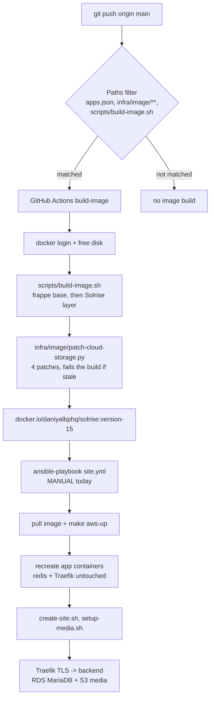

# 16 - Deployment pipeline status

What is automated, what is verified working, and what is still open. This is the
context document: read it first before touching the AWS stack, and update it
whenever a pipeline stage changes state.

Last updated: 2026-09-16 (verified on the live host).

---

## 1. The pipeline



Two stages are automated, one is not:

| Stage | Status | Trigger |
|---|---|---|
| Terraform provisioning (EC2, RDS, S3, IAM) | Working, manual | `cd infra/terraform && terraform apply` |
| Image build + push to Docker Hub | **Automated** | push to `main` touching `apps.json`, `infra/image/**`, `scripts/build-image.sh`, `scripts/push-image.sh`, `scripts/apps-fingerprint.py`, or the workflow; or `gh workflow run build-image.yml` |
| Deploy on the host (pull, rollout, site + media config) | Manual | `cd infra/ansible && ansible-playbook site.yml --ask-vault-pass` |

There is deliberately no CD workflow yet (see [Open items](#5-open-items)).

## 2. The live stack

| Fact | Value |
|---|---|
| AWS account / region | `358254890883` / `us-east-1` |
| EC2 host | `54.80.60.124` (tagged `Role=solrise-app`), Ubuntu 24.04, rootless Podman 4.9.3 + podman-compose 1.5.0 |
| Site / domain | `erp.solrise.online` (Traefik v3.7, Let's Encrypt `daniyalbphq@gmail.com`) |
| Database | RDS MariaDB `solrise-db.cyj2g0qsc566.us-east-1.rds.amazonaws.com:3306`, master `solrise_admin`, password only in Secrets Manager |
| Media | `s3://solrise-media-358254890883/solrise/` (private, versioned, AES256, TLS-only) |
| Backups | `s3://solrise-backups-358254890883` exists, but the S3 sync is **off** (`backup_s3_enabled: false`) |
| Image source | Docker Hub `docker.io/daniyalbphq/solrise:version-15` (**private repo**); ECR is unused (`ecr_repository_url` is empty) |
| Repo / remote | `git@github.com:daniyalbphq-commits/solrise-erp.git` (remote `origin`, SSH alias `github-bphq`) |
| Repo on the host | `/opt/solrise-erp` (cloned by the Ansible role, so it carries the dirty file modes the role's chmod task causes) |

Credentials, and where each one lives - no secrets in the repo:

| Secret | Lives in | Used by |
|---|---|---|
| RDS master password | Secrets Manager (`db_secret_arn`) | read on the host by the `solrise` role (instance role), then passed to `create-site` |
| Frappe admin password, Docker Hub username + token | Ansible Vault, `infra/ansible/group_vars/all/vault.yml` | deploy role (`.env` render, `podman login`) |
| S3 access | EC2 instance profile (`iam.tf`), no static keys | `cloud_storage` inside the container |
| `DOCKERHUB_USERNAME` / `DOCKERHUB_TOKEN` | GitHub repository **variables** today (workflow accepts `secrets.X || vars.X`) | `build-image` workflow |

> Move `DOCKERHUB_TOKEN` to repository *secrets*: variables are stored in plaintext
> and are not masked in the run logs. The workflow warns about this on every run.

## 3. Verified working

Evidence from the live stack on 2026-09-16. Re-run the checks in
[section 4](#4-how-to-verify) rather than trusting this list blindly.

| Capability | Verified how |
|---|---|
| CI build + push | `build-image` runs green for `8416d71`; image `docker.io/daniyalbphq/solrise:version-15` |
| Image contents | all four `cloud_storage` patches present, `make_thumbnail` a real `CloudStorageFile` method, files compile |
| Rollout | all six app containers recreated on the new image ID; `redis`/`proxy` untouched; site returns `200` |
| Media → S3 (uploads) | public and private uploads land in the bucket; `File.file_url` is `/api/method/retrieve?key=...`; `public/files` + `private/files` stay empty |
| Media → S3 (delete) | deleting a `File` removes the S3 object; an anonymous request for a private file gets `403` |
| Media → S3 (Data Import) | probe attachment on `Data Import` was served from the bucket (object present, 16 bytes) with nothing written to the volume |
| Media → S3 (thumbnails) | `make_thumbnail` resolves to `CloudStorageFile.make_thumbnail`, returns the cloud URL, creates no `<name>_small.<ext>` on disk |
| RDS wiring | site boots against RDS with the instance role reading the master secret on the host |
| Traefik TLS | `https://erp.solrise.online` serves `200` |

## 4. How to verify

Deploy, then check the four things that actually matter:

```bash
# on the workstation
cd infra/ansible && ansible-playbook site.yml --ask-vault-pass

# on the host (ssh -i ~/.ssh/solrise_ed25519 ubuntu@54.80.60.124)
export XDG_RUNTIME_DIR=/run/user/1000

# 1. which image is really running (must match the tag Docker Hub serves)
podman inspect --format '{{.Name}} {{.Image}}' solrise_backend_1

# 2. the patched app is in the running container
podman exec solrise_backend_1 grep -c 'Solrise:' \
  /home/frappe/frappe-bench/apps/cloud_storage/cloud_storage/cloud_storage/overrides/file.py

# 3. nothing is accumulating on the volume
podman exec solrise_backend_1 ls /home/frappe/frappe-bench/sites/erp.solrise.online/private/files \
                                       /home/frappe/frappe-bench/sites/erp.solrise.online/public/files

# 4. the site answers
curl -s -o /dev/null -w '%{http_code}\n' https://erp.solrise.online
```

Then upload a file in the UI and confirm the `File` row's `file_url` is
`/api/method/retrieve?key=solrise/...`. Full detail in
[`docs/15-s3-media-storage.md`](15-s3-media-storage.md).

### Running a Frappe script in the container

The container has no site context, so a script must `chdir` before importing
`frappe` (otherwise it looks for `/home/frappe/logs/database.log`):

```bash
podman exec -i solrise_backend_1 /home/frappe/frappe-bench/env/bin/python - <<'PY'
import os
os.chdir("/home/frappe/frappe-bench/sites")
import frappe
frappe.init(site="erp.solrise.online", sites_path="/home/frappe/frappe-bench/sites")
frappe.connect()
# ...
frappe.destroy()
PY
```

## 5. Open items

1. **The vault passphrase does not match the vault file** - this is the blocker for
   every `ansible-playbook` run, and therefore for the boot unit and backup cron
   below.
   * `infra/ansible/group_vars/all/vault.yml` (re-encrypted 05:24) decrypts with
     neither `/home/pc/.vault_pass` (16 bytes, 05:38) nor
     `/home/pc/.solrise_vault_pass.txt` (32 bytes).
   * `/home/pc/.solrise_vault_pass.txt` *does* decrypt the pre-05:24 copy,
     `vault.yml.lost`, which still holds all three values
     (`vault_admin_password`, `dockerhub_username`, `dockerhub_password`, a real
     `dckr_pat_...` token).
   * Two ways out, both needing the user: put the real passphrase in
     `/home/pc/.vault_pass`, or re-encrypt `vault.yml` from the recovered values
     using the passphrase already in that file.
2. **Boot unit not verified.** `solrise.service` is installed by the role, but
   `systemctl --user status solrise` was `not-found` on the last inspection, so the
   stack may not come up after a reboot. Container `restart: unless-stopped`
   policies do not help a rootless stack at boot; `loginctl enable-linger ubuntu`
   plus the unit is what does. Confirm after the next successful playbook run.
3. **Backup cron not verified.** The role installs it (`backup_cron_enabled: true`,
   `02:15`), but `crontab -l` for the deploy user showed no entries. Check after a
   successful run.
4. **No CD.** Deploy is manual by design - `build-image` has no AWS credentials and
   should not, but a separate `deploy.yml` could SSH in and run the playbook. That
   needs an SSH private key (or SSM) **and the vault passphrase** as GitHub
   secrets. Deliberately not built yet; say the word if you want it.
5. **`awscli` is not packaged for Ubuntu 24.04** (the host role warns instead of
   failing). Install the AWS CLI v2 bundle before enabling `backup_s3_enabled`.
6. **Host housekeeping.** ~95 dangling anonymous podman volumes and one 3.29 GB
   dangling image. Never prune the named `solrise_*` volumes.
7. **`path` filters mean unrelated pushes build nothing.** A docs-only or
   Ansible-only push will not trigger `build-image` - that is intended, but it also
   means a broken image can only be caught by a push that touches the build inputs.

## 6. Things that bit us (do not relearn these)

* **A re-pushed tag does not roll out by itself.** `podman-compose up -d` compares
  service *configuration*, not the image digest, so after `podman pull` the old
  containers keep running and the new image is silently unused. This is why
  `make aws-up` / `make prod-up` / `make local-up` now end with
  `up -d --force-recreate ${APP_SERVICES}` (app containers only, so redis, the
  queue and Traefik are left alone), and why there is a `make aws-rollout`.
  Symptoms if it regresses: fixes that "do not work" after a green CI run.
* **`no_log: true` hides the reason a task failed.** Both risky tasks in the role
  (Secrets Manager read, Docker Hub login) use `failed_when: false` plus an
  `assert` that prints `rc`/`stderr`.
* **The RDS secret must be read on the host**, via its instance role. Reading it
  with the `amazon.aws` lookup from the workstation fails with `AccessDenied`
  depending on which AWS credentials the shell happens to have.
* **`.env` is owned by Ansible** - it is re-rendered on every deploy, so hand
  edits are undone. Change `infra/ansible/group_vars/all/main.yml` instead. The
  rendered file must stay source-safe (`set -a; . ./.env`): quote any value
  containing a space, or the shell reads `COMPOSE_CMD=docker compose` as an
  assignment followed by a command and exits 127.
* **Container names.** `podman-compose` uses underscores, so the backend is
  `solrise_backend_1`; the docs use the friendly `solrise-backend`. List the real
  ones with `podman ps --format '{{.Names}}'`.
* **`terraform apply` rewrites `group_vars/all/terraform.yml`** (gitignored). If
  that file is missing or empty, the media task skips silently and
  `cloud_storage` is never installed - look for `cloud_storage` in
  `INSTALL_APPS` in the host `.env` to confirm.
* **The registry login is cached in tmpfs** (`/run/user/1000/containers/auth.json`),
  so it does not survive a reboot; the deploy re-creates it from the vault token.
  Pulls succeed without an explicit login only while that file exists.
* **`\"\\1\"` in a non-raw Python string is `U+0001`**, not a regex backreference -
  that is how a patch script once produced invalid Python. Patch regexes in
  `infra/image/patch-cloud-storage.py` use raw strings for this reason.
