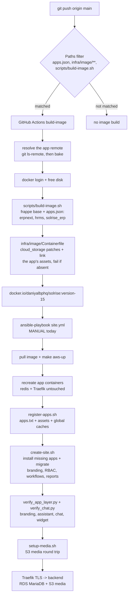
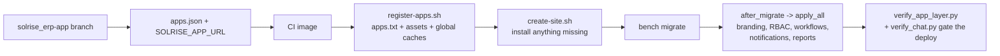

# 16 - Deployment pipeline status

What is automated, what is verified working, and what is still open. This is the
context document: read it first before touching the AWS stack, and update it
whenever a pipeline stage changes state.

Last updated: 2026-10-01. The vault is repaired, the customer portal shipped and
then had to be fixed (docs/17 section 4.1), the store master data and 26 store
logins are live, mail is configured, and the boot unit and nightly backup are
installed and proved (§6 item 2 is closed). What is left is the operator's: the
LLM provider key (§6 item 10), rotating the store password (§6 item 14), and
deploying the app revision recorded in `.build/app-rev`.

---

## 1. The pipeline


```mermaid
flowchart TD
    A[git push origin main] --> B{Paths filter<br/>apps.json, infra/image/**,<br/>scripts/build-image.sh}
    B -->|matched| C[GitHub Actions build-image]
    B -->|not matched| Z[no image build]
    C --> C0[resolve the app remote<br/>git ls-remote, then bake]
    C0 --> D[docker login + free disk]
    D --> E[scripts/build-image.sh<br/>frappe base + apps.json:<br/>erpnext, hrms, solrise_erp]
    E --> F[infra/image/Containerfile<br/>cloud_storage patches + link<br/>the app's assets, fail if absent]
    F --> G[docker.io/daniyalbphq/solrise:version-15]
    G --> H[ansible-playbook site.yml<br/>MANUAL today]
    H --> I[pull image + make aws-up]
    I --> J[recreate app containers<br/>redis + Traefik untouched]
    J --> J0[register-apps.sh<br/>apps.txt + assets + global caches]
    J0 --> K[create-site.sh<br/>install missing apps + migrate<br/>branding, RBAC, workflows, reports]
    K --> M[verify_app_layer.py + verify_chat.py<br/>branding, assistant, chat, widget]
    M --> N[setup-media.sh<br/>S3 media round trip]
    N --> L[Traefik TLS -> backend<br/>RDS MariaDB + S3 media]
```

Two stages are automated, one is not:

| Stage | Status | Trigger |
|---|---|---|
| Terraform provisioning (EC2, RDS, S3, IAM) | Working, manual | `cd infra/terraform && terraform apply` |
| Image build + push to Docker Hub | **Automated** | push to `main` touching `apps.json`, `apps.example.json`, `infra/image/**`, `scripts/build-image.sh`, `scripts/push-image.sh`, `scripts/apps-fingerprint.py`, or the workflow; or `gh workflow run build-image.yml`. **Publishing the app does NOT trigger a build** - `solrise_erp-app` is an orphan branch holding only the Frappe app, so it has no `.github/` and no `scripts/build-image.sh` (section 7) |
| Deploy on the host (pull, rollout, site + apps + branding, media, verification) | Manual | `cd infra/ansible && ansible-playbook site.yml` (the passphrase is read from `~/.vault_pass`; `--ask-vault-pass` overrides) |

There is deliberately no CD workflow yet (see [Open items](#6-open-items)).

## 2. The live stack

| Fact | Value |
|---|---|
| AWS account / region | `358254890883` / `us-east-1` |
| EC2 host | `54.80.60.124` (tagged `Role=solrise-app`), Ubuntu 24.04, rootless Podman 4.9.3 + podman-compose 1.5.0 |
| Site / domain | `erp.solrise.online` (Traefik v3.7, Let's Encrypt `daniyalbphq@gmail.com`) |
| Database | RDS MariaDB `solrise-db.cyj2g0qsc566.us-east-1.rds.amazonaws.com:3306`, master `solrise_admin`, password only in Secrets Manager |
| Media | `s3://solrise-media-358254890883/solrise/` (private, versioned, AES256, TLS-only) |
| Backups | RDS automated backups + point-in-time recovery, **35 days** (the maximum) - free, because backup storage is included up to 100% of the 50 GiB provisioned and the site uses ~0.5 GiB. `s3://solrise-backups-358254890883` exists, but the S3 sync is **off** (`backup_s3_enabled: false`) |
| Database cost | `db.t4g.small` Single-AZ ($23.36/month) + 50 GiB gp3 ($5.75/month) = **~$29/month**; Multi-AZ and Performance Insights are off. `db.t4g.micro` would be $11.68/month (see `infra/README.md` §11) |
| Image source | Docker Hub `docker.io/daniyalbphq/solrise:version-15` (**private repo**); ECR is unused (`ecr_repository_url` is empty) |
| Apps in the image | `erpnext`, `hrms`, `solrise_erp` (from `${SOLRISE_APP_URL}`), `cloud_storage` - baked by CI from `apps.json`. Until 2026-09-16 the Solrise app was missing here, so the image carried no branding and no chat |
| Apps on the site | `INSTALL_APPS` from the rendered `.env` (`install_apps` + `solrise_erp` + `cloud_storage` when those features are on); `scripts/create-site.sh` installs any that the site is missing |
| Application layer today | The app itself: `solrise_app_enabled: true`, published on the `solrise_erp-app` branch of this repository (now `5e0edb8`), baked in by CI and installed by `scripts/create-site.sh`. The customer portal, the store master data and the mail account shipped on 2026-10-01. See [§5.5](#55-the-app-layer-deployed-2026-09-17), [§5.6](#56-the-customer-portal-and-the-store-data-deployed-2026-10-01) and [§5.4](#54-the-app-less-interim-2026-09-16-superseded) |
| Boot / backup | `/home/ubuntu/.config/systemd/user/solrise.service` (`enabled`, `active`) and `/etc/cron.d/solrise-backup` (nightly `02:15`) - installed and proved on 2026-10-01, §6 item 2 |
| Repo / remote | `git@github.com:daniyalbphq-commits/solrise-erp.git` (remote `origin`). `core.sshCommand` pins `~/.ssh/id_ed25519_bphq`, which authenticates as `daniyalbphq-commits`; the default key authenticates as `DaniyalM`, who can read the (public) repo but is refused write: `Permission ... denied to DaniyalM` |
| Repo on the host | `/opt/solrise-erp` (cloned by the Ansible role, so it carries the dirty file modes the role's chmod task causes) |

Credentials, and where each one lives - no secrets in the repo:

| Secret | Lives in | Used by |
|---|---|---|
| RDS master password | Secrets Manager (`db_secret_arn`) | read on the host by the `solrise` role (instance role), then passed to `create-site` |
| Frappe admin password, Docker Hub username + token | Ansible Vault, `infra/ansible/group_vars/all/vault.yml` | deploy role (`.env` render, `podman login`) |
| S3 access | EC2 instance profile (`iam.tf`), no static keys | `cloud_storage` inside the container |
| `DOCKERHUB_USERNAME` / `DOCKERHUB_TOKEN` | GitHub repository **variables** today (workflow accepts `secrets.X || vars.X`) | `build-image` workflow |
| `SOLRISE_APP_URL` (app remote, and the token for it when private) | GitHub repository **secrets** | `build-image` workflow - `apps.json` bakes the app in from it |
| Assistant provider API key | **Solrise Settings** on the site (`api_key`, encrypted), entered by an operator | the LLM assistant and the chat's optional LLM slot-filler |
| SMS / WhatsApp provider credentials | **Solrise Notification Channel** on the site | `channels.dispatcher` (`docs/07`) |

> Move `DOCKERHUB_TOKEN` to repository *secrets*: variables are stored in plaintext
> and are not masked in the run logs. The workflow warns about this on every run.

## 3. Verified working

Evidence from the live stack on 2026-09-16. Re-run the checks in
[section 4](#4-how-to-verify) rather than trusting this list blindly. The
2026-09-17 application layer has its own table in §5.5, and the 2026-10-01
customer portal one in §5.6.

| Capability | Verified how |
|---|---|
| CI build + push | `build-image` runs green for `8416d71`; image `docker.io/daniyalbphq/solrise:version-15` |
| Image contents | all four `cloud_storage` patches present, `make_thumbnail` a real `CloudStorageFile` method, files compile |
| Rollout | all six app containers recreated on the new image ID; `redis`/`proxy` untouched; site returns `200` |
| Media → S3 (uploads) | public and private uploads land in the bucket; `File.file_url` is `/api/method/retrieve?key=...`; `public/files` + `private/files` stay empty |
| Media → S3 (delete) | deleting a `File` removes the S3 object; an anonymous request for a private file gets `403` |
| Media → S3 (Data Import) | probe attachment on `Data Import` was served from the bucket (object present, 16 bytes) with nothing written to the volume |
| Media → S3 (thumbnails) | `make_thumbnail` resolves to `CloudStorageFile.make_thumbnail`, returns the cloud URL, creates no `<name>_small.<ext>` on disk |
| RDS wiring | site boots against RDS with the instance role reading the master secret on the host |
| Traefik TLS | `https://erp.solrise.online` serves `200` |

## 4. How to verify

Deploy, then check the seven things that actually matter:

```bash
# on the workstation (the passphrase comes from ~/.vault_pass, see §6 item 1)
cd infra/ansible && ansible-playbook site.yml

# on the host (ssh -i ~/.ssh/solrise_ed25519 ubuntu@54.80.60.124)
export XDG_RUNTIME_DIR=/run/user/1000

# 1. which image is really running (must match the tag Docker Hub serves)
podman inspect --format '{{.Name}} {{.Image}}' solrise_backend_1

# 2. the patched app is in the running container
podman exec solrise_backend_1 grep -c 'Solrise:' \
  /home/frappe/frappe-bench/apps/cloud_storage/cloud_storage/cloud_storage/overrides/file.py

# 3. nothing is accumulating on the volume
podman exec solrise_backend_1 ls /home/frappe/frappe-bench/sites/erp.solrise.online/private/files \
                                       /home/frappe/frappe-bench/sites/erp.solrise.online/public/files

# 4. the site answers
curl -s -o /dev/null -w '%{http_code}\n' https://erp.solrise.online

# 5. the Solrise application layer is really installed: white labeling, the
#    assistant, the universal chat, the RBAC artifacts
cd /opt/solrise-erp && SITE_ENV=aws make verify

# 6. the chat answers, and its gates hold
cd /opt/solrise-erp && SITE_ENV=aws make verify-chat

# 7. a Customer may file an Issue and sees only their own; the store data is there
cd /opt/solrise-erp && SITE_ENV=aws make verify-portal
```

### When port 22 is unreachable

SSH is the normal way in, but the workstation's network blocks port 22 while
443 does not - so `ssh ubuntu@54.80.60.124` times out and `ansible-playbook`
with it. The host is still reachable over **SSM**, because the instance role
already carries `AmazonSSMManagedInstanceCore`:

```bash
# one command on the host
python3 scripts/host-run.py 'uptime'
python3 scripts/host-run.py --as-ubuntu 'podman ps'      # rootless stack
python3 scripts/host-run.py --put ./local.file /remote/path --as-ubuntu '...'
```

`--as-ubuntu` is required for anything touching `podman` (the containers live in
ubuntu's user session); without it the command runs as root. `--put` copies a
file first - needed for the boot unit, whose multi-line contents do not survive
the SSM document. `scripts/host-run.py` goes through boto3 because
`aws ssm send-command` aborts with `badly formed help string` on this CLI build.

**This is a way to run commands, not a replacement for the playbook.** Everything
`infra/ansible` does at deploy time still has to be done in order, by hand.

Then upload a file in the UI and confirm the `File` row's `file_url` is
`/api/method/retrieve?key=solrise/...`. Full detail in
[`docs/15-s3-media-storage.md`](15-s3-media-storage.md).

### Running a Frappe script in the container

The container has no site context, so a script must `chdir` before importing
`frappe` (otherwise it looks for `/home/frappe/logs/database.log`):

```bash
podman exec -i solrise_backend_1 /home/frappe/frappe-bench/env/bin/python - <<'PY'
import os
os.chdir("/home/frappe/frappe-bench/sites")
import frappe
frappe.init(site="erp.solrise.online", sites_path="/home/frappe/frappe-bench/sites")
frappe.connect()
# ...
frappe.destroy()
PY
```

## 5. The application layer: white labeling, chat and the rest of the product

**Status: deployed 2026-09-17, verified on the live site.** Until 2026-09-17 the
AWS deployment shipped **without the Solrise application layer**: `apps.json` had
lost its `${SOLRISE_APP_URL}` entry (commit `d969821`, "Prod build working") when
the first AWS build had to pass, so the image was plain platform + HRMS and the
site had no Solrise branding, no assistant, no universal chat, no RBAC fixtures, no
reports and no dashboards.

The app's source was then lost, so it was rebuilt from `docs/06`, `docs/07`,
`docs/10`, `docs/11` and `docs/12`, published on the **`solrise_erp-app` branch of
this repository** (`scripts/publish-app.sh`), baked into the image by CI
(`apps.json`), installed by `scripts/create-site.sh`, and is now live. Section 5.1
is the requirement, section 3 the evidence, section 5.5 what this deployment
actually did and where it hurt.

### 5.1 What the deploy must deliver

| # | Requirement | Applied by | How to check |
|---|---|---|---|
| 1 | **White labeling**: `Solrise` everywhere a user looks - Desk/tab title, login page and footer, website chrome, app switcher, sidebar workspaces, navbar logo, plus the **US/USD** locale defaults | `solrise_erp.branding.ensure_branding()` (from `after_migrate` -> `apply_all()`), with `boot.py`, `public/js/solrise_erp.js` and the footer template override for the payload the upstream app patches later | `make verify` (`System Settings.app_name`, `Website Settings.app_name`); then open the login page - it must read **Solrise**. Detail: `docs/10-branding.md` |
| 2 | **Modules and programmatic configuration** - HR/HRMS, Selling, Buying, CRM and Support settings, genders, leave types, SLA, assignment rule | `scripts/setup_erp.py`, run by `scripts/create-site.sh` on every deploy | re-run `./scripts/run-python.sh scripts/setup_erp.py`; every line is `= exists`, `= updated` or an explicit `skip`, never a duplicate |
| 3 | **RBAC**: the role catalogue, the DocPerm matrix, row-level rules and User Permission scoping | `scripts/roles_rbac.py` + `solrise_erp/permissions.py` hooks + `fixtures/solrise_erp/custom_docperm.json` | `make verify` (role checks); `docs/11-rbac.md` section 10 for the matrix |
| 4 | **Approval workflows** (leave, expense, quotation, purchase) with states and actions | app `apply_all()` on every `migrate` (+ `fixtures/.../workflow.json`) | `make verify` (workflow count); a new Leave Application shows the workflow action buttons |
| 5 | **Notifications**: in-app + email notifications, the daily digest and the SLA/stale scans; **SMS/WhatsApp** through a channel document | app `notifications.py` / `tasks.py`, run by the `scheduler` container | `make verify` (notification count, message log); configure a channel then `solrise_erp.api.v1.send_test_message`. Detail: `docs/07-phase4-notifications-reporting.md` |
| 6 | **Reporting**: nine `Solrise *` query reports and the **Solrise Operations** dashboard with five charts | app `reports.py` / `dashboards.py` on every `migrate` (+ fixtures) | `make verify` (report + dashboard checks); Desk -> Reports / Dashboard |
| 7 | **LLM assistant ("Ask Solrise")**: provider-agnostic chat over the user's own permissions, tool allowlist, rate limit, `Solrise Chat Log`, SLA/escalation/digest jobs | app `assistant/`, driven by **Solrise Settings**; needs an operator-supplied provider key | `make verify` (health + `api.chat`), then `engine.ask("How do I reset my password?")` in a bench console; detail: `docs/06-phase4-assistant.md` |
| 8 | **Universal chat entry flow**: one surface in Desk **and** Portal that resolves a request to a DocType operation, gates it on permissions, fills missing fields and audits every decision | app `chat/`, `api.chat.turn`, `Solrise AI Audit Log`, `public/js/solrise_chat.js` (`app_include_js` + `web_include_js`) | `make verify` (both endpoints exposed), then the manual walkthrough in `docs/12-phase5-universal-chat-entry-flow.md` section 8.2 |
| 9 | **Media on S3** | `cloud_storage` + `scripts/setup-media.sh` | section 3 of this document / `docs/15-s3-media-storage.md` |
| 10 | **Reproducibility**: all of the above is re-declared from code on every `bench migrate` and exported under `fixtures/` | `solrise_erp.install.apply_all()` + `make fixtures` | `make fixtures && git diff --exit-code fixtures` after a migrate |

> Rows 1-8 are the product. Without the app in the image they are simply absent -
> not broken, absent - which is why `apps.json` and `INSTALL_APPS` are part of the
> deployment contract and not build detail.

### 5.2 The chain that now enforces it


```mermaid
flowchart LR
    A[solrise_erp-app branch] --> B[apps.json + SOLRISE_APP_URL] --> C[CI image]
    C --> D[register-apps.sh<br/>apps.txt + assets + global caches]
    D --> E[create-site.sh<br/>install anything missing] --> F[bench migrate]
    F --> G[after_migrate -> apply_all<br/>branding, RBAC, workflows,<br/>notifications, reports]
    G --> H[verify_app_layer.py<br/>+ verify_chat.py gate the deploy]
```

* **`solrise_erp-app`** is the app, published as the root of its own branch of this
  repository by `scripts/publish-app.sh` (an orphan branch whose tree IS a Frappe
  app). The workflow watches that branch as well as `main`, so publishing the app
  rebuilds the image without a second, unrelated commit.
* **`apps.json`** (repo root) is the app list, and `${SOLRISE_APP_URL}` /
  `${SOLRISE_APP_BRANCH}` are expanded from the environment, so one file works on
  any host. `SOLRISE_APP_URL` is **optional**: the build defaults it to this
  repository (the app lives here) and only uses the secret when the app is in
  another repository. Before the bake it reads the branch with `git ls-remote` and
  either falls back to this repository with a warning or fails with the host and
  path - never the credentials. The URL is mounted as a BuildKit **secret**, so a
  token in it never reaches an image layer.
* **`effective_install_apps`** (role fact) appends `solrise_erp` when
  `solrise_app_enabled` is true (default) and `cloud_storage` when
  `s3_media_enabled` has a bucket to talk to.
* **`scripts/register-apps.sh` registers the apps the image carries** (§5.5, the
  trap that cost the most). `sites/` is a volume, so it shadows the image's own
  `sites/apps.txt`: an app a rebuild bakes in is present under `apps/` but unknown
  to bench. It writes the missing names, links each app's `public/` into `assets/`,
  and clears the bench-wide caches (`app_hooks`, `all_apps`, `installed_apps`,
  `assets_json`) that would otherwise keep the app invisible. `create-site.sh` runs
  it before installing anything; `clear-cache.sh` runs it on every rollout.
* **`scripts/create-site.sh` installs anything missing** before it migrates. The
  `create-site` service only installs `INSTALL_APPS` when it *creates* the site,
  so without this step a newly added app would be in the image and never on the
  site - which is exactly how the live site would have stayed unbranded.
* **`bench migrate`** runs `after_migrate` -> `solrise_erp.install.apply_all()`:
  branding, workspaces, roles/permissions, workflows, notifications, reports,
  dashboards and the app's DocTypes, plus the app's own `fixtures/`.
* **`scripts/verify_app_layer.py`** (`SITE_ENV=aws make verify`) fails the deploy
  when the app, the branding, the assistant/chat entry points or the
  configuration artifacts are missing. **`scripts/verify_chat.py`**
  (`SITE_ENV=aws make verify-chat`) has a conversation with the deployed chat and
  checks the widget's delivery. Anything only a human can decide is reported as a
  `warn`, not a failure.

### 5.3 What no deploy can do for you

These are the operator's, and they are the difference between "installed" and
"usable" - all of them live in site configuration, none in git:

* **The assistant's provider and key** - `Solrise Settings` (`enabled`, `provider`,
  `api_base_url`, `api_key`, `model`, `rate_limit_per_hour`). Until that is set,
  "Ask Solrise" and the chat's optional LLM slot-filler answer nothing.
  Programmatic form: `docs/06-phase4-assistant.md` section 4.2.
* **A messaging channel** for SMS/WhatsApp - `Solrise Notification Channel`
  (`docs/07-phase4-notifications-reporting.md` section 7.2).
* **The guardrail switches** - `allow_record_lookup` / `allow_ticket_creation` /
  `allow_status_update` on the assistant, `chat_allow_delete` /
  `chat_allow_approve` / `chat_enforce_permlevel` / `chat_allowed_doctypes` /
  `chat_allowed_workflows` on the chat, and the retention windows
  (`chat_log_retention_days`, `audit_log_retention_days`). Defaults are the safe
  ones; change them deliberately.
* **The `Company` record** - `bench new-site` does not run the setup wizard, so a
  fresh site has no company and HR/payroll/accounting refuse to work until you
  run it (`docs/08-execution-checklist.md` section 2.5).
* **Real users** - named accounts with the Stage 2 roles, 2FA on `Administrator`.

### 5.4 The app-less interim (2026-09-16, superseded)

The app had no source to build from, so it could not be in the image. Everything in
§5.1 that lives in *this* repository, or in the app's exported fixtures, was
deployed directly to `erp.solrise.online` instead - after a backup
(`/opt/solrise-erp/backups/20260916-174016/`) and with `bench migrate` left to the
next deploy. Kept because it is the history of the live database, and because
`scripts/branding_only.py` and `scripts/import_app_fixtures.py` are still what makes
the app-less path work.

| Requirement | Delivered by | Evidence on the live site |
|---|---|---|
| **White labeling** (the DocType half of `docs/10`) + US/USD locale | `scripts/branding_only.py` (new) | `System Settings.app_name` `ERPNext` -> `Solrise`, `language` `en`, `time_zone` `America/New_York`; `Website Settings.app_name` `Frappe` -> `Solrise`, `brand_html` lockup, `copyright` `Solrise`; login page renders **Login to Solrise**, **Create a Solrise Account**, **© Solrise**; `Company` `@solrise` -> `Solrise` (abbr stays `@solrise`) |
| **Modules and settings**, Issue SLA, routing rule | `scripts/setup_erp.py` (its first successful run here) | HR/Selling/Buying/CRM/Support settings set; `Earned Leave` + `Casual`/`Sick` leave types; Issue Priorities; `Solrise Default Holidays`; `SLA-Issue-Standard` (4 priorities, enabled, default); `Solrise Support Routing` (Round Robin, `status == 'Open'`) |
| **RBAC** | `scripts/roles_rbac.py` | 8 roles created; Custom DocPerm matrix written on 13 DocTypes, each after copying the DocType's shipped rules - `System Manager` keeps read/write/create/delete/submit on `Issue`, `Support Team` keeps its rows (no lockout) |
| **Approvals** | `scripts/import_app_fixtures.sh` (new) over `fixtures/.../workflow*.json` | 4 workflows: `Solrise Leave Approval`, `Solrise Expense Approval`, `Solrise Purchase Order Approval`, `Solrise Payment Approval` (Pending Approval -> Approved / Rejected / Escalated) |
| **Notifications** | same | 4 records: `Solrise New Ticket`, `Solrise SLA Breach Alert`, `Solrise Approval Pending`, `Solrise High Value Quotation` |
| **Reporting** | same | 7 `Solrise *` reports, all of which run without SQL errors; **Solrise Operations** dashboard with 4 charts (`Open Tickets by Status`, `Ticket Trend`, `Pipeline by Status`, `Headcount by Department`) |
| **NOT delivered** | - | `Solrise Settings`, the **LLM assistant**, the **universal chat entry flow** and `Solrise AI Audit Log`, the FAQ knowledge base, chat/message logs, the Desk boot patches (navbar/app-switcher logo, sidebar workspace labels), the app's scheduler jobs, and the 2 reports + 1 chart that query app tables |

The commands, in order (from `/opt/solrise-erp` on the host; `make branding` and
`make app-fixtures` wrap the last two):

```bash
SITE_ENV=aws ./scripts/run-python.sh scripts/setup_erp.py
SITE_ENV=aws ./scripts/run-python.sh scripts/roles_rbac.py
SITE_ENV=aws ./scripts/run-python.sh scripts/branding_only.py   # BRANDING_RENAME_COMPANY=1 to rename the Company
SITE_ENV=aws ./scripts/import_app_fixtures.sh
```

The deploy runs the last two automatically only while `solrise_app_enabled: false`
(`infra/ansible/roles/solrise`); with the app deployed they are a fallback for a
site that has lost it, and the app's own `fixtures/` do the work. Both are
idempotent, and both report what they skipped and why.

> Two import details worth keeping: the fixtures' `module: "Solrise ERP"` link is
dropped (only the app declares that Module Def), and the dashboard charts'
`is_standard: 1` is written as `0` - Frappe refuses to save a standard record
without an app behind it. The app's own `apply_all()` restores both values when it
is deployed.

When the app is found: add `SOLRISE_APP_URL`, set `solrise_app_enabled: true`, and
the deploy takes over - `install-app` + `after_migrate` re-applies workflows,
notifications, reports and dashboards with their app-owned metadata, and
`make verify` gates the result (the interim records already exist, so the app
updates them in place rather than duplicating them). That is what happened next.

### 5.5 The app layer, deployed (2026-09-17)

The app is rebuilt and live. `solrise_erp-app` (commit `4655516` at the time of
writing) is the app branch; image build run 9 baked it in; the host pulled it,
`create-site.sh` installed it, `bench migrate` applied its DocTypes and fixtures,
and both verification scripts pass against `erp.solrise.online`.

| Check | Command | Result |
|---|---|---|
| The app is on the site | `bench --site erp.solrise.online list-apps` | `solrise_erp 1.0.0` alongside frappe/erpnext/hrms/cloud_storage |
| The application layer | `SITE_ENV=aws make verify` | branding, roles, 4 workflows, 9 reports, dashboard, notifications all `ok` |
| The chat, end to end | `SITE_ENV=aws make verify-chat` | menu (8 entries), quick action -> missing-field question -> cancel, a read resolving to `Found 0 Issues.`, 4 audit rows written, injection phrase inert, anonymous turn refused |
| The widget's delivery | same script | `app_include_js`/`web_include_js` include it, the JS and logo are served, the cached manifest matches the image |
| The browser | `curl -s https://erp.solrise.online/login` | `Login to Solrise`, widget `<script>`, bundles `200 text/css` |

The last two rows matter: the chat answered on every endpoint for two rounds while
the widget could not load at all.

**What each failure was, so it is not re-learned:**

1. **`pip install -e .` needs a version.** `pyproject.toml` declares
   `dynamic = ["version"]`, so flit reads `__version__` from the package. The empty
   `__init__.py` failed metadata generation and the image build died in the app
   fetch, five minutes in, with no clue which input was wrong. The workflow now
   resolves the app URL before the bake and names it (never its credentials) when
   it cannot be read.
2. **`sites/` is a volume and shadows the image's `sites/apps.txt`.** An app a
   rebuild bakes in is under `apps/` but unknown to bench, so
   `bench install-app` refuses ("App solrise_erp not in apps.txt") - and
   `app_include_js`/`web_include_js` are ignored even once it is installed, because
   Frappe intersects the site's installed apps with `get_all_apps()` (read from
   that file) *before* loading hooks. `scripts/register-apps.sh` fixes both, and
   clears `app_hooks`/`all_apps`/`installed_apps`/`assets_json`, which cache the
   old answer.
3. **nginx serves `/assets` from the bench's `assets/` dir, which is in the image.**
   `bench init` writes `apps.txt` before `apps.json` is fetched, so `bench build`
   never linked the app's `public/` and `/assets/solrise_erp/*` answered 404 (with
   an HTML fallback, so the browser refused it as a stylesheet/script).
   `infra/image/Containerfile` now registers the app and creates the link, and
   fails the build if the file is not there.
4. **The asset manifest is cached in Redis** (`assets_json`). It held an older
   image's hashes, so every hashed `/assets/*.css` 404ed and the site rendered with
   no CSS at all. `scripts/clear-cache.sh` clears it on every rollout - and the
   app's own DocTypes made the site render *more* pages that noticed.
5. **Fixtures must not claim to be standard.** `Dashboard Chart.validate` throws
   "Cannot edit Standard charts" outside developer mode, so `migrate` stopped on
   `is_standard: 1` in the app's `dashboard_chart.json`. It is `0` now, and
   `custom_docperm.json` is deliberately not shipped at all (docs/11 rule 3).
6. **`create-site` sits behind the `init` profile**, so
   `compose run --rm create-site` reported "missing services" and the deploy
   stopped before touching the site. `restore.sh` already named the profile;
   `create-site.sh` does now too.
7. **Restarting the backend alone leaves nginx on a stale IP** (`502 Bad Gateway`
   for the whole site). Restart the frontend as well; a rollout recreates both, so
   this only bites when you restart one by hand.

### 5.6 The customer portal and the store data, deployed (2026-10-01)

Deployed from a workstation that cannot reach port 22, so the host was driven
over **SSM** (`scripts/host-run.py`) instead of `ansible-playbook`. The steps are
the playbook's, in its order: update the checkout, pull the image, `make aws-up`,
`create-site.sh`, then the two one-off seeders. The app branch is `5e0edb8`; the
image is config `a4178f12`, build run **10**.

| Check | Command | Result |
|---|---|---|
| The image carries the portal | `podman run --entrypoint bash <image> -lc 'ls apps/solrise_erp/solrise_erp/portal/'` | `catalog.py guard.py identity.py` |
| The app layer still verifies | `SITE_ENV=aws make verify` | branding, roles, 4 workflows, 9 reports, dashboard, notifications, chat hooks all `ok` |
| The portal verifies | `SITE_ENV=aws make verify-portal` | every check `ok`, 0 failed |
| Customer permissions | same script | read/write/create/**share** on Issue, `if_owner=1` |
| The landing page | same script | `role_home_page` maps `Customer` to `['start']`; both pages exist in the app |
| Store master data | same script | 37 Customers, 36 Contacts, 32 Contact→Customer links, 17 with a `store_code` |
| Support routing | same script | every enabled `Support Manager` is in `Solrise Support Routing` |
| The site answers | `curl` | `/login` `200`, `/api/method/ping` `200`, `/start` and `/start/logout` `301` (to `/login`) |
| CSS is served | `curl -I` | `erpnext.bundle.4JCFPWFM.css` → `200 text/css`; the old hashed URL from the "broken CSS" report is gone |
| Mail | `./scripts/configure_email.sh` with `SL_TEST_TO` | authenticated SMTP over implicit TLS, test message delivered; `Email Queue` = `Sent` |
| A report actually files | `POST api/method/solrise_erp.api.portal.create_issue` as a store login | `ISS-2026-00001` created, subject `Refrigeration - Solrise 39`, priority `High`, assigned to a Support Manager |
| The store logins work | `POST /api/method/login` with the national digits | `7019892311` → Brett Van Dam, `home_page` `/start`; a wrong password is refused |
| One store vs four | same, `/start/report-issue` | Brett gets the form directly; Tammy's picker offers her Solrise 28/30/31/42 and not 39 |
| A stray login is sent back | `api.portal.portal_home` | customer → `{"home": "/start"}`; Guest and desk user → `{"home": null}` |
| The 403 page can still rescue | `curl /app` as a store login | `403` whose body carries `solrise_portal.js`, `frappe-session-status="logged-in"` and `data-path="message"` - all three guards |
| Boot unit | `systemctl --user is-enabled/is-active solrise` | `enabled`, `active` |
| Nightly backup | the cron job's own command, run once | 1.8 MB written to `/opt/solrise-erp/backups/<stamp>/` |

**The store logins were created on request, with one password for all of them.**
`STORES_DEFAULT_PASSWORD='sol-cust-1' SITE_ENV=aws ./scripts/import_stores.sh`
created 26 logins covering 31 of the 32 store rows (the 5 Montana stores have no
manager in the sheet, and one `Saqib` Customer is not from the sheet at all).
This is the interim the docs warn about - the operator asked for it explicitly and
intends to replace the passwords later. `scripts/store_logins.py` prints the
hand-out sheet, including the password column when `STORE_LOGINS_PASSWORD` is set.

**The submission path needed a fix the same day.** The first real report from the
station UI came back as `PermissionError: No permission to share Issue`. The
cause, the evidence and the fix are docs/17 section 4.1; the corrected grant was
applied to the live site immediately, and the durable fix is in the app revision
recorded in `.build/app-rev` (build run 11).

**And a station login was left with nowhere to go.** Frappe refuses the whole
`/app` tree to a `Website User` - correct, and the reason the Desks stayed shut -
but the *unauthenticated* door went in a circle: a Guest on `/app/issue` was
bounced to `/login?redirect-to=/app/issue`, and after logging in that returned the
customer to the same 403. The portal's scripts are already loaded on that page, so
they now ask `api.portal.portal_home` and move a customer to `/start`; the 403
itself is unchanged. Both server-side options were rejected as worse than the
problem (a static redirect would lock the support team out of their own Desk;
`website_path_resolver` would replace Frappe's path resolution site-wide) - docs/17
section 12 has the measurements and the reasoning. Deployed as build run 12.

**What this deploy fixed, beyond shipping the app** - all three were found by
actually running the thing, and all three are recorded in §7:

1. the `solrise_erp-app` trigger in `build-image.yml` could never fire;
2. the boot unit could not start the stack at all;
3. with the wrong `podman-compose`, the unit then looped the `init`-only
   `create-site` service forever.

## 6. Open items

1. ~~**The vault passphrase does not match the vault file.**~~ **Resolved 2026-10-01.**
   This was the blocker for every `ansible-playbook` run, and therefore for the
   boot unit and backup cron below.
   * The three values were recovered from `vault.yml.lost`, which still decrypted
     with `/home/pc/.solrise_vault_pass.txt` (`vault_admin_password`,
     `dockerhub_username`, `dockerhub_password` - a real `dckr_pat_...` token).
   * `group_vars/all/vault.yml` was re-encrypted from exactly those values with
     that passphrase, so it decrypts again. The re-encryption reproduces the
     original file's byte length, so nothing was lost. The unreadable copy is
     kept beside it as `vault.yml.undecryptable.bak` (`vault.yml*` is gitignored,
     so neither ever enters the repo).
   * The passphrase now lives in **one** place, `/home/pc/.vault_pass`, and
     `infra/ansible/ansible.cfg` sets `vault_password_file = ~/.vault_pass`, so
     `ansible-playbook site.yml` needs no flag. `--ask-vault-pass` still wins when
     you would rather type it.
   * Verified with a throwaway local play: the admin password resolves (24 chars),
     `dockerhub_username` is `daniyalbphq`, and the token starts with `dckr_`.
2. ~~**The stack does not survive a reboot, and nothing backs it up.**~~ **Resolved
   2026-10-01.** Both were installed by hand over SSM, matching what the role
   renders, and both were then proved rather than assumed:
   * `/home/ubuntu/.config/systemd/user/solrise.service` exists, is `enabled` and
     `active`, and `systemctl --user start` exits 0 - _after_ the two bugs in §7
     were fixed. The stack now comes back on its own after a reboot.
   * `/etc/cron.d/solrise-backup` holds the nightly `02:15` job. It had never run,
     so the job's own command was run once by hand: 1.8 MB landed in
     `/opt/solrise-erp/backups/20260930-204038/`.

   Note this was done by hand because the workstation cannot reach port 22. A real
   `ansible-playbook site.yml` still has not run end to end, so treat the parts of
   the role that only it exercises as unverified.
3. **`DOCKERHUB_TOKEN` is weaker than it should be.** It is a repository
   *variable*: stored in plaintext and not masked in run logs. Move it to Secrets
   (the workflow warns about this on every run). The vault half of this item is
   closed - the passphrase lives only in `/home/pc/.vault_pass`.
4. **No CD.** Deploy is manual by design - `build-image` has no AWS credentials and
   should not, but a separate `deploy.yml` could SSH in and run the playbook. That
   needs an SSH private key (or SSM) **and the vault passphrase** as GitHub
   secrets. Deliberately not built yet; say the word if you want it.
5. **`awscli` is not packaged for Ubuntu 24.04** (the host role warns instead of
   failing). Install the AWS CLI v2 bundle before enabling `backup_s3_enabled`.
6. **Host housekeeping.** ~95 dangling anonymous podman volumes and one 3.29 GB
   dangling image. Never prune the named `solrise_*` volumes.
7. **`path` filters mean unrelated pushes build nothing.** A docs-only or
   Ansible-only push will not trigger `build-image` - that is intended, but it also
   means a broken image can only be caught by a push that touches the build inputs.
8. ~~**`apps/solrise_erp` does not exist anywhere reachable.**~~ **Resolved
   2026-09-17:** the app's source was lost for good (the exhaustive search below
   found only the local `git daemon` URL in this repo's `.env`), so it was rebuilt
   from the docs, published on the `solrise_erp-app` branch of this repository and
   deployed - see §5.5.

   <details><summary>the original search (kept so it is not repeated)</summary>

   This working copy (no `apps/` at all), the repo's entire git history, the whole
   filesystem of the workstation and of the EC2 host, every podman
   layer/volume/container on both, and GitHub (`DaniyalM/solrise_erp` and
   `daniyalbphq-commits/solrise_erp` are both 404; neither project repo,
   `daniyalbphq-commits/solrise-erp` nor `DaniyalM/solrise-erp`, contains it). The
   only trace was this repo's `.env`:
   `SOLRISE_APP_URL=git://host.containers.internal:9418/solrise_erp` with
   `SOLRISE_APP_REV=0c7923cc8c274cfe51398422c938f5dd310944e3` - a local
   `git daemon` served it from the machine that ran the local/VPS stack, and that
   clone was never pushed.

   </details>
9. **The `SOLRISE_APP_URL` secret holds a value the build cannot read, and is no
   longer needed.** The workflow now defaults the app source to this repository
   (where the app's branch lives), warns when a configured remote cannot be read,
   and only fails when neither is reachable - which is why run 9 built anyway. A
   leftover secret still *wins* over the default, so delete it (or point it at the
   repository that holds the app) to stop the warning on every build. An SSH URL
   can never work: CI has no key, hence the `git ls-remote` check.
10. **The assistant is not configured on the live site.** `Solrise Settings` has
    no provider and no key, so "Ask Solrise" and the chat's LLM fallback answer
    nothing until an operator sets them (section 5.3; `make verify-chat` reports
    both as warnings). The deterministic chat works without it - the menu, ticket
    creation, lookups, approvals and the audit trail are all live. A messaging
    channel is likewise absent. Both are business decisions, and both are the
    difference between *installed* and *usable*.
11. **The verification scripts have all now run against a live host** (`make verify`,
    `make verify-chat`, `make verify-portal`) - see §5.5 and §5.6 for what they
    reported. Keep them in step with section 5.1: a new requirement needs a check
    here, or it is an acceptance list again. `verify_portal.py` exists because
    neither of the other two covers the portal: they would have passed while the
    Customer role had no permission to file anything.
12. ~~**The customer portal and the store data are published but NOT deployed.**~~
    **Resolved 2026-10-01** - see §5.6. The image was rebuilt (run 10), rolled out,
    the store master data imported and the mail account configured. What remains
    from this item is only the store **logins**, which is item 14.
13. ~~**The mail account is configured locally, not on the live site.**~~
    **Resolved 2026-10-01.** `Solrise Support` (`info@solrisestores.com`, SMTP 465
    implicit TLS) is live on `erp.solrise.online` and sent a real test message;
    `Email Queue` reports `Sent`. Production mail works - and it needs to, because
    the "Solrise New Ticket" notification to the Support Manager is the whole point
    of the portal (docs/17). See `docs/19`.

    Still open under this item: the mail server's TLS certificate expires
    **2026-10-02** (the day after this was written). Renew it on the mail host or
    outbound mail starts failing closed.
14. ~~**The 26 store logins do not exist yet.**~~ **Created 2026-10-01 on request,**
    with one shared password (`sol-cust-1`) - the operator's explicit call, to be
    replaced later. What is still open from this item:
    * **the shared password is a rehearsal measure** (docs/18 §5.2). Rotate it, or
      fill the CSV's `email` column so each login is a real account and
      "Forgot password" works - today a forgotten password must be reset in the
      Desk, because nothing can be delivered to `@stores.invalid`.
    * **the 5 Montana stores (Solrise 51-55) have no manager in the sheet**, so no
      contact and no possible login. That is a gap in `New Stores info.xlsx`.
    * `scripts/store_logins.py` (`make logins`) prints the hand-out sheet - one row
      per manager per store, with the sign-in username and, when
      `STORE_LOGINS_PASSWORD` is set, the password column.

## 7. Things that bit us (do not relearn these)

* **The boot unit had never been run, and could not have worked.** It was written
  and reasoned about but never started - the `solrise` role installs it after the
  deploy steps, and no playbook run ever got that far. Started once by hand it
  failed twice, and both faults were invisible to every static check:
  1. `ExecStart` ran `podman-compose ... --env-file .env` without exporting `.env`.
     podman-compose substitutes `${VAR}` from *its own environment*, and
     `compose.aws.yaml` guards `${DB_HOST:?}` - so the unit died with
     `DB_HOST must point at the RDS endpoint` and the stack never came up. Only
     the Makefile's `export` had ever supplied those variables, which is why every
     hand-run deploy worked. The unit now does `set -a; . ./.env; set +a` first.
  2. It hardcoded `/usr/bin/podman-compose`. That is the distro's **1.0.6**, which
     ignores `profiles:`; the stack actually uses the pipx **1.5.0** named by
     `COMPOSE_CMD` in `.env`. 1.0.6 therefore started `create-site`, an
     `init`-only one-shot that inherits `restart: unless-stopped` from `*backend` -
     so it exited and was restarted forever, logging "site already exists" in a hot
     loop. The unit now execs `$COMPOSE_CMD`, and `create-site` is `restart: "no"`
     in all three compose files so no implementation can loop it.
  The lesson is not "test the unit", it is that a deploy path nobody has executed
  is a draft. Both faults are in `docs/16` §6 item 2, which claimed the unit was
  "one successful playbook run away" - it was one playbook run away from failing.
* **Publishing the app does not rebuild the image.** The `solrise_erp-app` branch
  was listed in `build-image.yml`'s `on.push.branches`, and `solrise_erp/**` in
  its `paths`, as if pushing the app triggered a build. It cannot: the branch is
  an orphan whose root is the Frappe app, so it has no `.github/` (nothing to
  trigger) and no `scripts/build-image.sh` (nothing for the job's own checkout to
  run). Published app, stale image, no run in the Actions tab - and it looks like
  a successful publish. The trigger is `main` only, and the handshake is
  **`.build/app-rev`**: record the published revision there and push, which both
  starts the build and leaves the answer to "which app commit is in this image?"
  in the repository. `publish-app.sh` now ends by printing the exact line to add
  instead of implying the publish was enough.
* **A Customer could not submit a report, because `share` was 0.** Found on the
  live site the day the portal went out, and the worst kind of bug: intermittent.
  Frappe's assignment path (`assign_to._add` -> `frappe.share.add`) shares a
  newly assigned document with its assignee **as the user who created it** - the
  station employee - and `check_share_permission` requires the acting user to
  hold `share`. The Customer grant listed every flag except that one, so the
  submission died at the last step with `No permission to share Issue` and was
  rolled back: the customer's report vanished and the page showed a failure. It
  only fires when `has_permission(doc, user=assignee)` is False, so which
  assignee the rule picks decides whether it happens at all. `install.py` now
  grants `share` (still `if_owner`, so only the customer's own reports), and
  `install.ensure_portal_permissions()` **reconciles** an existing `Custom
  DocPerm` instead of skipping it - the skip is why the fix would otherwise never
  have reached the site that already had the row. See docs/17 section 4.1.
* **A re-pushed tag does not roll out by itself.** `podman-compose up -d` compares
  service *configuration*, not the image digest, so after `podman pull` the old
  containers keep running and the new image is silently unused. This is why
  `make aws-up` / `make prod-up` / `make local-up` now end with
  `up -d --force-recreate ${APP_SERVICES}` (app containers only, so redis, the
  queue and Traefik are left alone), and why there is a `make aws-rollout`.
  Symptoms if it regresses: fixes that "do not work" after a green CI run.
* **`no_log: true` hides the reason a task failed.** Both risky tasks in the role
  (Secrets Manager read, Docker Hub login) use `failed_when: false` plus an
  `assert` that prints `rc`/`stderr`.
* **The RDS secret must be read on the host**, via its instance role. Reading it
  with the `amazon.aws` lookup from the workstation fails with `AccessDenied`
  depending on which AWS credentials the shell happens to have.
* **`.env` is owned by Ansible** - it is re-rendered on every deploy, so hand
  edits are undone. Change `infra/ansible/group_vars/all/main.yml` instead. The
  rendered file must stay source-safe (`set -a; . ./.env`): quote any value
  containing a space, or the shell reads `COMPOSE_CMD=docker compose` as an
  assignment followed by a command and exits 127.
* **Container names.** `podman-compose` uses underscores, so the backend is
  `solrise_backend_1`; the docs use the friendly `solrise-backend`. List the real
  ones with `podman ps --format '{{.Names}}'`.
* **`terraform apply` rewrites `group_vars/all/terraform.yml`** (gitignored). If
  that file is missing or empty, the media task skips silently and
  `cloud_storage` is never installed - look for `cloud_storage` in
  `INSTALL_APPS` in the host `.env` to confirm.
* **The registry login is cached in tmpfs** (`/run/user/1000/containers/auth.json`),
  so it does not survive a reboot; the deploy re-creates it from the vault token.
  Pulls succeed without an explicit login only while that file exists.
* **`\"\\1\"` in a non-raw Python string is `U+0001`**, not a regex backreference -
  that is how a patch script once produced invalid Python. Patch regexes in
  `infra/image/patch-cloud-storage.py` use raw strings for this reason.
* **A rollout leaves the *old* asset manifest in Redis, and the site then renders
  with no CSS at all.** `bench build` hashes every asset filename and writes the
  manifest to `sites/assets/assets.json` **in the image**, while Frappe caches it
  in Redis as `assets_json`. `make aws-up` / `aws-rollout` / `prod-up` recreate the
  app containers on the new image but leave redis running on purpose (that is what
  keeps the cache warm) - so the manifest stays at the previous image's hashes.
  Symptoms, in order: the page renders unstyled; `/assets/**.css` returns `200`
  with `text/html`; the browser console says *Refused to apply style ... MIME type
  ('text/html') is not a supported stylesheet MIME type*; nginx logs `404` for
  `/assets/frappe/dist/css/website.bundle.<HASH>.css`. Verify with
  `podman exec solrise_redis-cache_1 redis-cli get assets_json | strings | grep -o 'login.bundle.[A-Z0-9]*.css'`
  against `ls .../sites/assets/frappe/dist/css/ | grep login.bundle` - different
  hashes means this is the bug. Fix: `SITE_ENV=aws make clear-cache`
  (`bench --site <site> clear-cache`, which deletes `bench_cache_keys`), and the
  next request re-reads the manifest. The rollout, redeploy and deploy paths now
  call `scripts/clear-cache.sh` themselves, so this should not come back.
* **An app missing from `apps.json` fails silently - nothing errors, the feature is
  simply gone.** The `${SOLRISE_APP_URL}` entry was dropped in `d969821` to get a
  build to pass, and the deployment then ran as platform + HRMS with no white
  labeling, no assistant, no chat and no reports; every existing check still
  passed because none of them referenced those features. That is why the app list
  is now a deployment requirement with three places kept in agreement (`apps.json`,
  `install_apps`/`solrise_app_enabled`, and `scripts/verify_app_layer.py`) and why
  the CI build refuses to run without the app remote rather than quietly shipping
  a smaller product.
