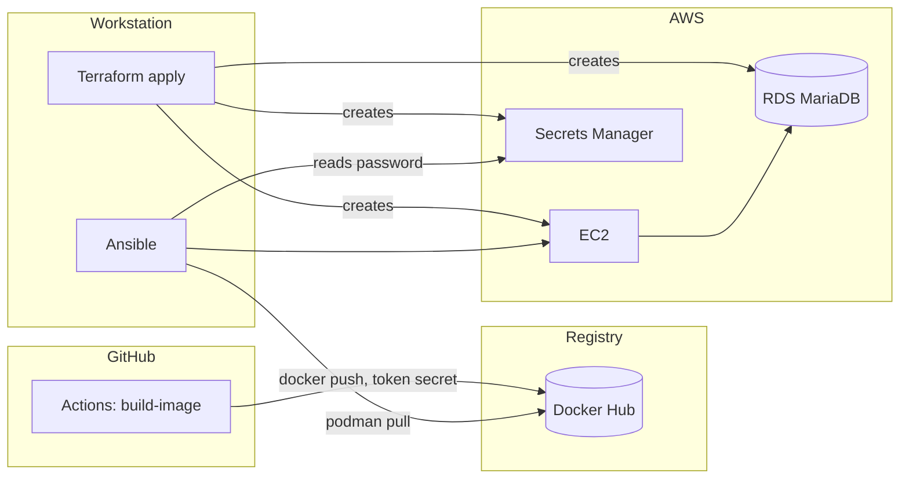

# Deploying Solrise ERP on AWS (EC2 + RDS MariaDB) with Terraform and Ansible

This directory is the AWS deployment path from the main README: the application
runs on **EC2**, the database is **MariaDB on RDS**, infrastructure is
provisioned by **Terraform**, and the host is configured and deployed by
**Ansible**.

The image is built **once in GitHub Actions and pushed to Docker Hub** — the slow
bake (frappe + erpnext + hrms + the Solrise application layer + cloud_storage,
~15 min, memory-hungry) never runs on the production host. Ansible only pulls it.

> **Read [`PREREQUISITES.md`](PREREQUISITES.md) first.** It lists every account,
> key, credential and GitHub setting you need before `terraform init` and before
> `ansible-playbook`, plus the minimum IAM policies.

The in-repo VPS path (`docs/03-phase3-production-vps.md`) runs everything on one
host with MariaDB in a container. This path replaces only the database container
with managed RDS — the app tier is otherwise identical.

## Image supply chain



## Division of labour

| Concern | Tool | Files |
|---|---|---|
| VPC, subnets, security groups | Terraform | `terraform/network.tf`, `terraform/security.tf` |
| EC2 + Elastic IP + IAM/SSM role | Terraform | `terraform/compute.tf`, `terraform/iam.tf` |
| RDS MariaDB + parameter group (utf8mb4) | Terraform | `terraform/rds.tf` |
| RDS master password (generated + rotated) | Terraform (AWS-managed) | `terraform/rds.tf` → Secrets Manager |
| ECR repository (optional) + S3 backup bucket + S3 media bucket | Terraform | `terraform/storage.tf` |
| Instance-role policy for the media bucket | Terraform | `terraform/iam.tf` |
| GitHub OIDC provider + CI push role (only needed for the optional ECR path) | Terraform | `terraform/github_oidc.tf` |
| Route 53 A record | Terraform | `terraform/dns.tf` |
| Terraform → Ansible handoff | Terraform | `terraform/outputs.tf` → `ansible/inventory/hosts.ini`, `ansible/group_vars/all/terraform.yml` |
| **Image build + push to Docker Hub** | **GitHub Actions** | `.github/workflows/build-image.yml`, `scripts/build-image.sh`, `scripts/push-image.sh` |
| The Solrise application layer (white labeling, RBAC, assistant, chat, reports) | GitHub Actions + Ansible | `apps.json` (`${SOLRISE_APP_URL}`), `ansible/roles/solrise` (`install_apps`), `scripts/verify_app_layer.py` |
| cloud_storage app in the image + its patch | GitHub Actions | `apps.json`, `infra/image/` |
| OS hardening, rootless Podman, podman socket | Ansible | `ansible/roles/host` |
| `.env`, image pull, stack, site, systemd, backups | Ansible | `ansible/roles/solrise` |
| Site file storage on S3 (config, credential check, migration) | Ansible + scripts | `ansible/roles/solrise`, `scripts/setup-media.sh`, `scripts/configure_s3_media.py` |

## The app-side prerequisite

RDS is external, so the stack uses **`compose/compose.aws.yaml`** — identical to
`compose.prod.yaml` minus the `mariadb` service, with `DB_HOST`/`DB_PORT` read
from `.env` and site creation using the RDS master user. That is wired through the
rest of the repo:

- `SITE_ENV=aws` selects it (`scripts/lib.sh`), so `backup.sh`, `restore.sh`,
  `create-site.sh` and `run-python.sh` all work unchanged.
- `make aws-up` / `aws-down` / `aws-logs` are the Make targets.
- `scripts/create-site.sh` skips the "wait for mariadb" step when there is no
  embedded database, and installs any app from `INSTALL_APPS` that the site does
  not have yet — which is how the Solrise application layer reaches a site that
  already exists (see §7).

## Prerequisites (summary)

Full detail in [`PREREQUISITES.md`](PREREQUISITES.md). In short, before
`terraform init` you need: an AWS account + region, AWS credentials for a
principal that can create the resources, an SSH key pair, a domain + ACME email,
and a Docker Hub account + access token. Before the image build you additionally
need the **`SOLRISE_APP_URL` secret** (the `solrise_erp` app repository, with an
access token in the URL when it is private) — without it there is no white
labeling, no assistant and no chat in the image. Before Ansible you additionally
need: the SSH private key, an Ansible Vault passphrase, and **the image already
pushed to Docker Hub**. No AWS credentials are needed on the control node.

## 1. Provision (Terraform)

```bash
cd infra/terraform
cp terraform.tfvars.example terraform.tfvars
$EDITOR terraform.tfvars          # domain, email, SSH key, github_repository, ssh_cidr_blocks
terraform init
terraform apply
```

`apply` writes two files consumed by Ansible:

- `infra/ansible/inventory/hosts.ini` — the host and its IP (gitignored)
- `infra/ansible/group_vars/all/terraform.yml` — RDS endpoint, secret ARN, domain, ECR URL, bucket

Record the outputs you need next:

```bash
terraform output github_actions_role_arn   # -> GitHub variable AWS_ROLE_ARN
terraform output ecr_repository_url        # -> GitHub variable ECR_REPOSITORY_URL
terraform output app_public_ip
terraform output rds_endpoint
```

> **Engine version.** Confirm RDS offers what you set:
> `aws rds describe-db-engine-versions --engine mariadb --query 'DBEngineVersions[].EngineVersion'`.
> `db_engine_version` and `db_parameter_group_family` must match (`11.4` ↔ `mariadb11.4`).

## 2. Build the image in CI (GitHub Actions)

Set the repository secrets from `PREREQUISITES.md` §4 (`DOCKERHUB_USERNAME`,
`DOCKERHUB_TOKEN`, `SOLRISE_APP_URL`), then either push to `main` or run the
workflow by hand:

```bash
gh workflow run build-image.yml -f tag=version-15
gh run watch
```

It logs in to Docker Hub with the token, builds `scripts/build-image.sh` and
pushes `scripts/push-image.sh`. The image name follows the token's account unless
you set the `CUSTOM_IMAGE` variable, so the default result is:

```
docker.io/<DOCKERHUB_USERNAME>/solrise:version-15
```

`SOLRISE_APP_URL` is **required**: the image bakes the Solrise application layer
(white labeling, RBAC, assistant, universal chat, reports) from that git remote,
so an empty value stops the workflow with an actionable error instead of shipping
a bare ERPNext image. Use `https://x-access-token:<PAT>@github.com/<owner>/<app>`
when the app repository is private, and keep `SOLRISE_APP_BRANCH` (`main`) in step
with `solrise_app_branch` in `group_vars/all/main.yml`.

`CUSTOM_TAG` (GitHub) must equal `custom_tag`, and the effective image name must
equal `custom_image`, in `infra/ansible/group_vars/all/main.yml` - otherwise the
host pulls something CI never pushed. A push to `main` touching `apps.json`,
`infra/image/**` or the build scripts triggers a rebuild automatically.

> Offline fallback: empty `custom_image` in `group_vars/all/main.yml` and
> `rebuild_image: true` builds on the EC2 host instead (also set
> `enable_ecr = false` unless you want the Terraform-created ECR repository).
> This reintroduces the ~15-minute host build and is not the default.
>
> ECR is still supported: leave `custom_image` empty and Terraform's
> `ecr_repository_url` is used instead (the CI workflow no longer pushes there,
> so you would push with `./scripts/push-image.sh` from a logged-in host).

## 3. Secrets (Ansible Vault)

The RDS master password is **not** in Vault or in `.tfvars` — AWS generates it,
rotates it, and stores it in Secrets Manager. You only supply the Frappe
`Administrator` password:

```bash
cd infra/ansible
cp group_vars/all/vault.example.yml group_vars/all/vault.yml
$EDITOR group_vars/all/vault.yml          # set vault_admin_password
ansible-vault encrypt group_vars/all/vault.yml
```

Point `repo_url`, `solrise_app_url` and branches at your repositories in
`group_vars/all/main.yml`.

## 4. Configure and deploy (Ansible)

```bash
cd infra/ansible
ansible-galaxy collection install -r requirements.yml
ansible-playbook site.yml --ask-vault-pass
```

The playbook:

1. installs podman, `podman-compose`, git, `python3-boto3`, ufw, fail2ban; creates swap
   and the sysctl values Redis/Traefik/rootless Podman need;
2. enables lingering + the rootless `podman.socket`;
3. clones the repo to `/opt/solrise-erp` and renders `.env` from the Terraform facts
   and Vault (RDS endpoint, generated master password, domain, image, `INSTALL_APPS`);
4. **logs in to Docker Hub and pulls the image** (no build), brings the stack up
   (`make aws-up`), and creates the site — which reaches RDS with
   `DB_ROOT_USERNAME`/`DB_ROOT_PASSWORD`; apps that are missing on an *existing*
   site (`solrise_erp`, `cloud_storage`) are installed here;
5. **verifies the application layer** — white labeling, the assistant and the
   universal chat entry points, the RBAC roles and the reports — and fails the
   deploy when they are absent (`scripts/verify_app_layer.py`);
6. installs a **rootless user systemd unit** so the stack comes back after reboot,
   and a daily backup cron (optionally syncing files to S3);
7. gates on `GET https://<site>/api/method/ping` returning 200 (Let's Encrypt
   issuance is part of that wait).

Scope the run when iterating:

```bash
ansible-playbook site.yml --tags host   --ask-vault-pass  # OS prep only
ansible-playbook site.yml --tags deploy --ask-vault-pass  # redeploy only
```

## 5. Redeploying after a code change

- **App image changed** → push to `main` (or run the workflow), then:
  ```bash
  ansible-playbook site.yml --tags deploy --ask-vault-pass
  ```
- **Only config/scripts changed** → just re-run the `deploy` tag; `rebuild_image`
  is already `false`, so the image is not rebuilt.
- **Pin a rollback** → run the workflow with an older `tag`, set that tag in
  `group_vars/all/main.yml`, and re-run `deploy`. `PULL_POLICY=always` makes the
  host fetch the newly tagged image.

## 6. Uploaded files on S3 (media)

Attachments and images are stored in a **private, versioned S3 bucket** instead
of the EC2 volume. `terraform apply` creates the bucket and grants the instance
role access to it; the deploy installs the `cloud_storage` app on the site, points
it at the bucket (credentials come from the instance profile, so there is nothing
secret to manage) and proves it with a round trip. Files already on the volume are
migrated on request.

Full write-up, including the build-time patch the app needs, the migration
procedure, the backup implications and the caveats:
[`docs/15-s3-media-storage.md`](../docs/15-s3-media-storage.md).

```bash
terraform output media_bucket        # the bucket
SITE_ENV=aws make media              # re-apply the storage settings on the host
```

## 7. The application layer (white labeling, assistant, chat, RBAC, reports)

The deployment is not "ERPNext on AWS" - it is **Solrise**. Everything that makes
it Solrise lives in the custom app `solrise_erp`, so the app is part of the
deployment contract at three points:

| Layer | What it does | Where it is configured |
|---|---|---|
| `apps.json` → `${SOLRISE_APP_URL}` | bakes the app into the image in CI (with `erpnext`, `hrms`, `cloud_storage`) | `apps.json`, GitHub secret `SOLRISE_APP_URL` |
| `install_apps` → `INSTALL_APPS` | installs it on the site; `create-site.sh` also installs it on a site that already exists | `group_vars/all/main.yml` (`solrise_app_enabled`) |
| `after_migrate` → `solrise_erp.install.apply_all()` | applies everything below, idempotently, on every `bench migrate` | the app (no site configuration needed) |

What that app delivers, and how to check it after a deploy:

| Feature | Detail | Check |
|---|---|---|
| **White labeling + US/USD locale** | `Solrise` in the tab/Desk brand, login page, footer, website chrome, app switcher, sidebar workspaces and navbar logo; `United States`/`USD`/`en`/`America/New_York` defaults | `SITE_ENV=aws make verify`; open the login page — it must read **Solrise**. [`docs/10-branding.md`](../docs/10-branding.md) |
| **Modules and settings** | HR/HRMS, Selling, Buying, CRM and Support settings, genders, leave types, SLA, assignment rule | `./scripts/run-python.sh scripts/setup_erp.py` re-run reports `= exists`/`= updated` |
| **RBAC** | Role catalogue, DocPerm matrix, row-level rules, User Permission scoping | `make verify` (roles); [`docs/11-rbac.md`](../docs/11-rbac.md) |
| **Approvals** | Leave, expense, quotation and purchase workflows | `make verify` (workflow count) |
| **Notifications** | In-app + email alerts, SLA/stale scans, daily digest, SMS/WhatsApp channels | `make verify`; then `solrise_erp.api.v1.send_test_message`. [`docs/07-phase4-notifications-reporting.md`](../docs/07-phase4-notifications-reporting.md) |
| **Reporting** | Nine `Solrise *` query reports + the **Solrise Operations** dashboard (5 charts) | `make verify`; Desk → Reports / Dashboard |
| **LLM assistant ("Ask Solrise")** | Permission-scoped natural-language help over an allowlisted tool set, rate limited, audited in `Solrise Chat Log` | `make verify` (health), then `engine.ask("How do I reset my password?")`. [`docs/06-phase4-assistant.md`](../docs/06-phase4-assistant.md) |
| **Universal chat entry flow** | One chat surface in Desk **and** Portal that resolves a request to a DocType operation, gates it on permissions, fills required fields one at a time and writes `Solrise AI Audit Log` | `make verify` (both endpoints), then the walkthrough in [`docs/12-phase5-universal-chat-entry-flow.md`](../docs/12-phase5-universal-chat-entry-flow.md) §8.2 |

### 7.1 Configure the assistant (required before it answers)

The provider is **site configuration**, not a deploy secret - there is nothing to
put in Vault or in the Terraform variables. Set it in **Solrise Settings** in the
Desk, or programmatically inside the container:

```bash
podman exec -i solrise_backend_1 /home/frappe/frappe-bench/env/bin/python - <<'PY'
import os
os.chdir("/home/frappe/frappe-bench/sites")
import frappe
frappe.init(site="<site>", sites_path="/home/frappe/frappe-bench/sites")
frappe.connect()
doc = frappe.get_doc("Solrise Settings")
doc.enabled = 1
doc.provider = "OpenAI"                 # or Ollama / Azure OpenAI / Custom
doc.api_base_url = "https://api.openai.com/v1"
doc.api_key = "<key>"                   # stored encrypted
doc.model = "gpt-4o-mini"
doc.max_tokens = 1024
doc.temperature = 0.2
doc.rate_limit_per_hour = 60
doc.chat_enable_llm_fallback = 0        # deterministic chat only, until you opt in
doc.save(ignore_permissions=True)
frappe.destroy()
PY
```

Keep the key in a password manager and rotate it on a schedule. With an external
provider, user messages and record names leave your infrastructure; a self-hosted
[Ollama](https://ollama.com) (`http://<host>:11434/v1`, no key) keeps them inside
your account. (Container names use underscores - list them with
`podman ps --format '{{.Names}}'`.)

### 7.2 What else only a human can decide

These are `Solrise Settings` fields with safe defaults, and they are the
difference between *installed* and *usable*:

| Setting | Default | Decide when |
|---|---|---|
| `allow_record_lookup`, `allow_ticket_creation`, `allow_status_update` | lookup/create on, status update off | before announcing the assistant |
| `chat_enable_llm_fallback` | off (deterministic chat only) | after the LLM provider is configured and tested |
| `chat_allow_delete`, `chat_allow_approve` | off | only with a review process |
| `chat_allowed_doctypes`, `chat_allowed_workflows` | empty = menu/registry defaults | to narrow what chat may touch |
| `chat_log_retention_days`, `audit_log_retention_days`, `message_log_retention_days` | 90 / 180 / 180 | against your data-protection policy |

A `Company` record is also required before HR/payroll/accounting work:
`bench new-site` does not run the setup wizard
(`docs/08-execution-checklist.md` §2.5).

```bash
SITE_ENV=aws make verify    # the full check list, exits non-zero when a requirement is missing
```

### 7.3 Running without the app (interim)

The app's source is not available anywhere at the moment (see
`docs/16-deployment-pipeline-status.md` §6 item 8), so the image cannot carry it.
While `solrise_app_enabled: false`, the deploy applies the parts of §7 that live in
this repository or in the app's exported fixtures, and skips the app's install and
verification:

| Command | What it does |
|---|---|
| `SITE_ENV=aws make branding` | White labeling at the DocType level (`scripts/branding_only.py`): `System Settings`/`Website Settings` names and login brand, footer, US/USD locale, optionally the `Company` name |
| `SITE_ENV=aws make app-fixtures` | Imports the exported workflows, notifications, reports and dashboards that need no app (`scripts/import_app_fixtures.sh`) |
| `SITE_ENV=aws make verify` | Only useful with `solrise_app_enabled: true` - it checks for the app itself |

Roles/permissions (`scripts/roles_rbac.py`) and the module settings, Issue SLA and
routing rule (`scripts/setup_erp.py`) run as part of `create-site.sh` either way.
What this cannot deliver - the assistant, the universal chat, `Solrise Settings`,
the FAQ, the Desk boot patches and the app's scheduled jobs - is listed in
`docs/16-deployment-pipeline-status.md` §5.4.

## 8. Migrating existing data onto RDS

The existing backup/restore path works because the restore talks to whatever
`db_host` points at:

```bash
# workstation, from the repo root
make backup                                    # ./backups/<stamp>/
scp -r backups/<stamp> ubuntu@<eip>:/tmp/solrise-backup

# on the EC2 host
cd /opt/solrise-erp
SITE_ENV=aws BACKUP_DIR=/tmp/solrise-backup ./scripts/restore.sh /tmp/solrise-backup/<stamp> --new
```

`DB_ROOT_USERNAME` and `DB_ROOT_PASSWORD` come from the rendered `.env`; the
restore creates the site and loads the dump into RDS. Public/private files land
on the EBS volume (and are what the S3 sync protects).

## 9. Day-two operations

| Task | Command |
|---|---|
| Stack status | `SITE_ENV=aws make ps` (or `make aws-logs`) |
| Application layer check | `SITE_ENV=aws make verify` |
| Clear caches (after a rollout, or if the site renders unstyled) | `SITE_ENV=aws make clear-cache` |
| Shell on the host | `ssh ubuntu@<eip>` or `aws ssm start-session --target <instance-id>` |
| Bench shell | `podman exec -it solrise-backend bash` |
| Migrate | `podman exec -it solrise-backend bench --site <site> migrate` |
| DB snapshot / PITR | RDS console (automated, `db_backup_retention_days`) |
| File backups | `/opt/solrise-erp/backups` + optional `s3://<bucket>/files/` |
| Uploaded files (media) | `s3://<media bucket>/` - versioned, no expiry; migrate with `SITE_ENV=aws make media` |
| Rotate master password | Secrets Manager rotation on the RDS-managed secret |
| Traefik cert | `openssl s_client -connect <domain>:443 -servername <domain>` |
| Rebuild image | `gh workflow run build-image.yml` |

## 10. Teardown

`db_deletion_protection = true` and a final snapshot are on by default. For a
throwaway stack set `db_deletion_protection = false` and (optionally)
`db_skip_final_snapshot = true`, then:

```bash
cd infra/terraform && terraform destroy
```

The EBS volumes are deleted with the instance; RDS keeps its final snapshot. The
ECR repository is retained unless you remove it too.

## Known limitations / follow-ups

- **The application layer is a hard dependency of the image build.** `apps.json`
  bakes `solrise_erp` from `${SOLRISE_APP_URL}`, and the workflow stops with an
  actionable error when that secret is empty rather than shipping a bare ERPNext
  image (white labeling, the assistant and the universal chat all live in that
  app). If the app repository is genuinely unavailable, delete the entry from
  `apps.json` and set `solrise_app_enabled: false` (that flag is what appends
  `solrise_erp` to `INSTALL_APPS` and runs the verification) - the deployment then
  works but is plain platform + HRMS.
- **The app layer has never been deployed to the live AWS host.** The first
  `ansible-playbook` run after `apps.json` regained the app is the one that
  installs it, and `scripts/verify_app_layer.py` is new - run
  `SITE_ENV=aws make verify` and fold the result back into
  `docs/16-deployment-pipeline-status.md` §3. Take a backup first: the app's
  `install-app` + `migrate` writes roles, permissions and workflows on a live
  site.
- The **rootless user systemd unit** is the one piece that needs verification on a
  live host: `systemctl --user status solrise` should show it active after
  `loginctl enable-linger`. (The repo previously relied only on container restart
  policies, which do not bring a rootless stack up at boot.)
- `awscli` is not in Ubuntu 24.04's repositories; the host role now warns instead
  of failing when `backup_s3_enabled` or the ECR path asks for it. Install the
  AWS CLI v2 bundle on the host before enabling either (the S3 *media* path does
  not need it - the app uses boto3 inside the container).
- The S3 backup sync is **off** by default (`backup_s3_enabled: false`); turn it on
  once you have confirmed credentials work on the host. It covers the *database*
  dump plus any files still on the volume - uploaded files live in the media
  bucket and are protected by its versioning instead
  (`docs/15-s3-media-storage.md`).
- The media bucket depends on a small build-time patch of `cloud_storage`
  (`infra/image/patch-cloud-storage.py`): instance-profile credentials, no
  `Data Import` bypass, no local thumbnails, and no LibreOffice. The image build
  fails if the pinned release no longer matches the patch, so bump the tag in
  `apps.json` deliberately, together with the patch. See
  `docs/15-s3-media-storage.md`.
- **A re-pushed image tag only goes live because `make aws-up` recreates the app
  containers.** podman-compose compares service configuration, not the image
  digest, so a plain `up -d` would leave the old containers running and the freshly
  pulled tag unused. If you bring the stack up by hand, use
  `SITE_ENV=aws make aws-up` (or `make aws-rollout`), not a bare
  `podman-compose up -d`.
- Read replicas are not wired into Frappe; the RDS endpoint is a single writer.
- The CI workflow triggers on `main` by default. Adjust the branch filter and
  `github_oidc_branch` together if you deploy from another branch.
